# AhmedMonib E-Shop — Enterprise-Grade E-commerce Shop

> Production-ready, enterprise-grade e-commerce storefront (React + Vite frontend, Node.js + Express
> backend) with:
>
> - Secure rotated refresh tokens and sliding 30-day sessions (mobile-aware keep-alive)
> - Product variants, per-variant stock & pricing, cart reservation and automatic stock restore on
>   cancel/expire
> - Stripe Checkout integration with robust webhook handling (PaymentIntent verification, refunds,
>   expired sessions)
> - Order export (PDF) & fulfilment tooling, GDPR data export, Sentry observability, and 89.28% test
>   coverage.

---

## Table of contents

- [AhmedMonib E-Shop — Enterprise-Grade E-commerce Shop](#ahmedmonib-e-shop--enterprise-grade-e-commerce-shop)
  - [Table of contents](#table-of-contents)
  - [Maintainer context](#maintainer-context)
  - [One-line pitch](#one-line-pitch)
  - [Live demo \& hosted domains](#live-demo--hosted-domains)
  - [Monorepo architecture \& workspaces](#monorepo-architecture--workspaces)
    - [Workspaces](#workspaces)
    - [Common scripts](#common-scripts)
    - [Environment references](#environment-references)
  - [Deployment surfaces \& release workflow](#deployment-surfaces--release-workflow)
    - [Frontend (Vercel)](#frontend-vercel)
    - [Backend (Railway Docker image)](#backend-railway-docker-image)
    - [Mobile app (Expo custom dev client)](#mobile-app-expo-custom-dev-client)
  - [Mobile deep-link flow overview](#mobile-deep-link-flow-overview)
  - [Mobile app architecture \& features](#mobile-app-architecture--features)
    - [Key capabilities](#key-capabilities)
    - [Native integrations](#native-integrations)
    - [Mobile documentation](#mobile-documentation)
    - [Mobile screenshots](#mobile-screenshots)
  - [What this repo contains](#what-this-repo-contains)
  - [Key features (summary)](#key-features-summary)
  - [Payment \& order flow (detailed)](#payment--order-flow-detailed)
    - [Checkout (Stripe) flow — `createCheckoutSession`](#checkout-stripe-flow--createcheckoutsession)
    - [Stripe webhooks \& async handling — `stripeWebhook`](#stripe-webhooks--async-handling--stripewebhook)
    - [COD flow (Cash-on-Delivery) — `createCODOrder` \& `codCheckoutSuccess`](#cod-flow-cash-on-delivery--createcodorder--codcheckoutsuccess)
    - [Stock reservation \& restoration (variant-aware)](#stock-reservation--restoration-variant-aware)
    - [Failure \& expired session handling](#failure--expired-session-handling)
  - [Products, variants \& model behavior](#products-variants--model-behavior)
    - [Product creation \& image upload pipeline (frontend → backend → Cloudinary)](#product-creation--image-upload-pipeline-frontend--backend--cloudinary)
      - [1) Frontend (Create / Edit Product forms)](#1-frontend-create--edit-product-forms)
      - [2) Upload middleware (backend)](#2-upload-middleware-backend)
      - [3) Image processing (Sharp)](#3-image-processing-sharp)
      - [4) Cloudinary upload \& cleanup](#4-cloudinary-upload--cleanup)
      - [5) Variants \& image mapping](#5-variants--image-mapping)
      - [6) Storage of record](#6-storage-of-record)
      - [7) Environment (what to set)](#7-environment-what-to-set)
      - [8) Operational notes](#8-operational-notes)
  - [Auth \& session persistence — how it works (plain language)](#auth--session-persistence--how-it-works-plain-language)
  - [Order fulfilment, PDF export \& canceled order labeling](#order-fulfilment-pdf-export--canceled-order-labeling)
  - [GDPR \& user data export](#gdpr--user-data-export)
  - [Security \& observability](#security--observability)
  - [Testing \& CI](#testing--ci)
    - [How to run tests](#how-to-run-tests)
    - [Test status](#test-status)
  - [How to run locally (no Docker)](#how-to-run-locally-no-docker)
    - [Local HTTPS for development (optional but recommended)](#local-https-for-development-optional-but-recommended)
  - [Environment variables used](#environment-variables-used)
    - [Example `.env` for local development (copy \& fill)](#example-env-for-local-development-copy--fill)
    - [Deployment platform variables (Railway / Vercel)](#deployment-platform-variables-railway--vercel)
  - [Redis debugging quick commands](#redis-debugging-quick-commands)
  - [Screenshots](#screenshots)
    - [Orders \& Fulfilment](#orders--fulfilment)
    - [Create Product \& Variants](#create-product--variants)
    - [Analytics \& Campaigns](#analytics--campaigns)
    - [Emails](#emails)
    - [Mobile](#mobile)
  - [Commercial license (proprietary) \& selling notes](#commercial-license-proprietary--selling-notes)
  - [Contact / commercial enquiries](#contact--commercial-enquiries)
  - [Mobile app download placeholder](#mobile-app-download-placeholder)
  - [Demo credentials (web \& mobile)](#demo-credentials-web--mobile)

---

## Maintainer context

This project is built and maintained by a single freelance developer. Any "playbook" style
documentation in [`docs/`](docs/) is optional scaffolding kept around for potential future growth of
the project into a team setting; it is **not** required for day-to-day solo development. Feel free
to ignore those extras unless you want structured guidance when collaborating with additional
contributors later on.

---

## One-line pitch

Enterprise-grade e-commerce storefront with robust session security, per-variant inventory,
reservation/restore logic, Stripe payments, order fulfilment tooling, and production observability.

---

## Live demo & hosted domains

- Frontend (production): `https://www.ahmedmonib-eshop-demo.com` (Vercel)
- Frontend (alternate / staging): `https://ecommerce-mern-website-seven.vercel.app`
- API (production): `https://api.ahmedmonib-eshop-demo.com` (Railway)
- Railway preview: `https://e-commerce-mern-stack-website-production.up.railway.app`

---

## Monorepo architecture & workspaces

This repository is an npm **workspace monorepo**. Every app or shared package lives in its own
workspace so tooling, builds, and deployments stay isolated but share a single lockfile.

### Workspaces

| Workspace    | Path        | Purpose                                                                         |
| ------------ | ----------- | ------------------------------------------------------------------------------- |
| `frontend`   | `frontend/` | React (Vite) SPA deployed to Vercel.                                            |
| `backend`    | `backend/`  | Express API deployed to Railway using the root Dockerfile.                      |
| `mobile`     | `mobile/`   | Expo + React Native custom development client (Android) with deep-link support. |
| `shared`     | `shared/`   | Localization bundle consumed by web and mobile clients.                         |
| `packages/*` | `packages/` | Supporting libraries (e.g., eslint configs) shared across apps.                 |

### Common scripts

Run scripts from the repo root unless noted otherwise:

```bash
npm install                     # bootstrap every workspace with a single lockfile
npm run dev                     # concurrently start backend (https://localhost:5001) + frontend (https://localhost:5173)
npm run dev:all                 # start backend, frontend, and Expo dev server together
npm -w backend run dev          # backend only (nodemon + HTTPS)
npm -w frontend run dev         # frontend only (Vite dev server)
npm -w mobile run start:tunnel  # Expo dev client over tunnel with cache bust (-c)
npm -w mobile run env:<profile> # copy mobile/.env.<profile> -> mobile/.env (emu|lan|tunnel)
```

Additional workspace scripts:

```bash
npm -w backend test             # backend Jest suite
npm -w frontend run build       # production build for Vercel
npm -w mobile run android       # rebuild/install the custom dev client (native changes)
npm -w mobile run start:local   # Metro bound to localhost (Android emulator)
npm -w mobile run start:lan     # Metro on LAN (update HOSTNAME env in package.json first)
```

### Environment references

Solo development rarely needs heavy process docs, but these optional references are available if you
decide to collaborate with others or formalise operations:

- [`mobile/env.md`](mobile/env.md) — environments, workspace responsibilities, run modes, deployment
  checklists.
- [`mobile/dev-setup.md`](mobile/dev-setup.md) — Android toolchain, device connectivity, Expo
  workflows.
- [`docs/deployment.md`](docs/deployment.md) — optional release runbook covering frontend, backend,
  and mobile rollouts when multiple people coordinate deployments.
- [`docs/security/access-controls.md`](docs/security/access-controls.md) — optional template for
  documenting account provisioning and least-privilege roles once more contributors join.
- [`docs/INCIDENT_RESPONSE.md`](docs/INCIDENT_RESPONSE.md) — optional production incident playbook
  if you later need structured response expectations.

---

## Deployment surfaces & release workflow

### Frontend (Vercel)

- Project **Root Directory** must be `frontend`.
- `frontend/vercel.json` enforces `npm ci --legacy-peer-deps`, configures rewrites for `/api/*`, and
  applies SPA fallbacks + cache headers.
- Trigger deployments from CI or manually via CLI:

  ```bash
  npm -w frontend run build      # optional smoke build locally
  npx vercel link                # once per machine
  npx vercel --prod --yes        # production deploy (uses Vercel auth)
  ```

- Required environment variable:
  `PUBLIC_CLIENT_FALLBACK_URL=https://www.ahmedmonib-eshop-demo.com/reset-password`.

### Backend (Railway Docker image)

- Railway deploys the API using the root [`Dockerfile`](Dockerfile). It installs only the backend
  workspace and runs `backend/src/server.js` in production mode.
- Useful commands:

  ```bash
  docker build -t eshop-backend:latest .
  docker run --rm -p 5000:5000 -e NODE_ENV=production eshop-backend:latest
  ```

- Required Railway variables:

  | Key                          | Example                                                    | Notes                                      |
  | ---------------------------- | ---------------------------------------------------------- | ------------------------------------------ |
  | Key                          | Example                                                    | Notes                                      |
  | ---------------------------- | ------------------------------------------------------     | ------------------------------------------ |
  | `SESSION_SECRET`             | `base64:Vh1YhGq7...`                                       | Generate a 32+ byte random string.         |
  | `SESSION_REDIS_PREFIX`       | `session:`                                                 | Optional; keep consistent across envs.     |
  | `PUBLIC_CLIENT_FALLBACK_URL` | `https://www.ahmedmonib-eshop-demo.com/reset-password`     | Must match the frontend fallback.          |
  | `MOBILE_RESET_REDIRECT_URI`  | `eshop://reset-password`                                   | Deep link opened by reset emails.          |
  | `MOBILE_MAIL_CONFIRM_URI`    | `eshop://mailing/confirm`                                  | Deep link opened by mailing emails.        |
  | `MAIL_CONFIRM_WEB_URL`       | `https://shop.example.com/mailing/confirm?token={{token}}` | Overrides the browser confirmation URL.    |
  | `MOBILE_OAUTH_REDIRECT_URI`  | `eshop://oauth`                                            | Deep link used by OAuth providers.         |

- Redeploy whenever you change env vars, email templates, or native deep-link paths.

### Mobile app (Expo custom dev client)

- Expo project lives in `mobile/` with a custom dev client that registers the `eshop://` scheme and
  Android intent filters.
- Install/update the dev client after native or deep-link changes:

  ```bash
  npm -w mobile run android     # builds & installs via Gradle
  npm -w mobile run env:tunnel  # copy HTTPS API profile for remote testing
  npm -w mobile run start:tunnel
  ```

- Deep-link smoke test:

  ```bash
  npx uri-scheme open "eshop://reset-password?token=TEST123&email=user%40example.com" --android
  ```

Refer to [`mobile/env.md`](mobile/env.md) for the full run-mode matrix and env profiles.

---

## Mobile deep-link flow overview

- Password reset emails include both a web fallback (`PUBLIC_CLIENT_FALLBACK_URL`) and a deep link
  (`MOBILE_RESET_REDIRECT_URI`).
- Android intent filters in `mobile/app.config.js` accept the `eshop://` scheme and route to the
  Expo app.
- Navigation prefixes: `['eshop://', 'exp+eshop-mobile://']` with screen config
  `{ ResetPassword: 'reset-password' }`.
- `extractResetParams` normalizes `token`/`code` query params and surfaces them as React Navigation
  route params.
- `ResetPassword` screen lives in both auth and authed stacks so the user always lands on the
  correct screen whether the app is cold-started or already in memory.
- Metro logs beginning with `🔗` confirm the linking handlers fired; re-run
  `npx uri-scheme open ...` to verify changes.

---

## Mobile app architecture & features

### Key capabilities

- **Shared domain logic:** Mobile consumes the same REST API as the web frontend through the
  `packages/api-client` workspace, reusing authentication flows, cart logic, and localization from
  the shared bundle.
- **Offline-friendly UX:** Secure tokens are cached in Expo SecureStore with background refresh
  logic so shoppers remain signed in across cold starts.
- **Full shopping journey:** The app surfaces the entire catalogue, promotional sliders, cart,
  checkout, order history, profile management (including GDPR data export and account deletion), and
  transactional policy screens.
- **Deep-link aware navigation:** Any email CTA (reset password, mailing confirmation, OAuth
  completion) can launch straight into the appropriate native screen thanks to the linking config
  described above.

### Native integrations

- **Expo custom dev client** with an Android `eas build` profile for shipping a signed release
  build.
- **Secure credential storage** through Expo SecureStore and Android keystore-backed encryption.
- **Splash screen & icons** managed in `mobile/app.config.js` with adaptive icon layers.
- **Over-the-air updates** remain available through Expo runtime while still allowing a Play Store
  binary release.

### Mobile documentation

All mobile-specific runbooks live alongside the app code:

- [`mobile/env.md`](mobile/env.md) — Environment matrix, API profiles (emulator/LAN/tunnel), and
  deployment checklist.
- [`mobile/custom-dev-setup.md`](mobile/custom-dev-setup.md) — Android Studio, Java, Gradle, and
  Expo prerequisites for a fresh machine.
- [`mobile/docs/mobile-checkout-flow.md`](mobile/docs/mobile-checkout-flow.md) — Annotated checkout
  sequence from product selection to confirmation screens.
- [`mobile/docs/android-release-play-store.md`](mobile/docs/android-release-play-store.md) — Release
  readiness checklist for generating an Android App Bundle and submitting to Play Console.
- [`mobile/docs/docs/mobile/android-build-config.md`](mobile/docs/docs/mobile/android-build-config.md)
  — Native build configuration (gradle.properties, signing files, `eas.json` notes).
- [`mobile/certs/README.md`](mobile/certs/README.md) — How signing certificates are stored and
  rotated during release.
- Expo CLI metadata (`mobile/.expo/`) is ephemeral and Git-ignored; regenerate locally via
  `expo start` when needed.

### Mobile screenshots

Representative UI captures (see [`docs/screenshots`](./docs/screenshots)):

- 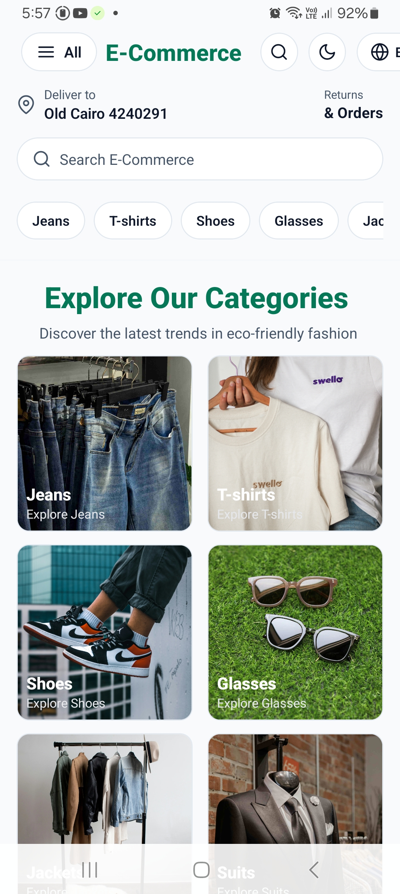 _Native home screen with
  featured sliders._
- 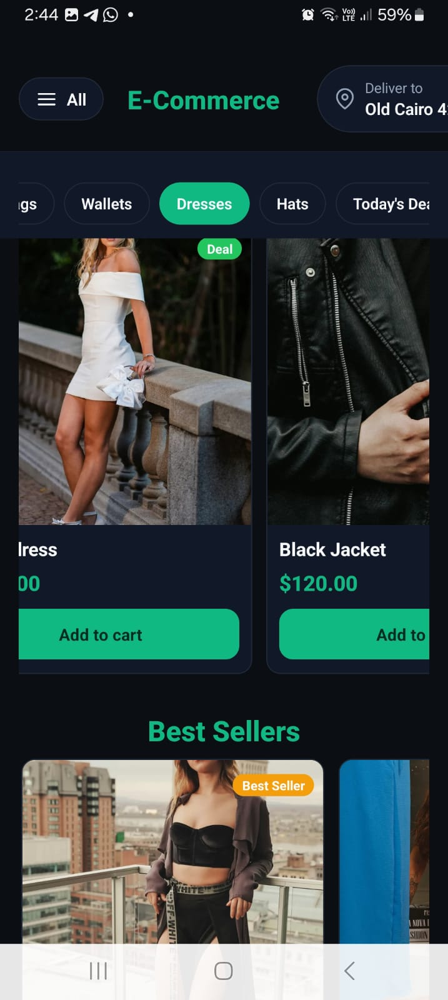
  _Dark mode promotional rails._
- 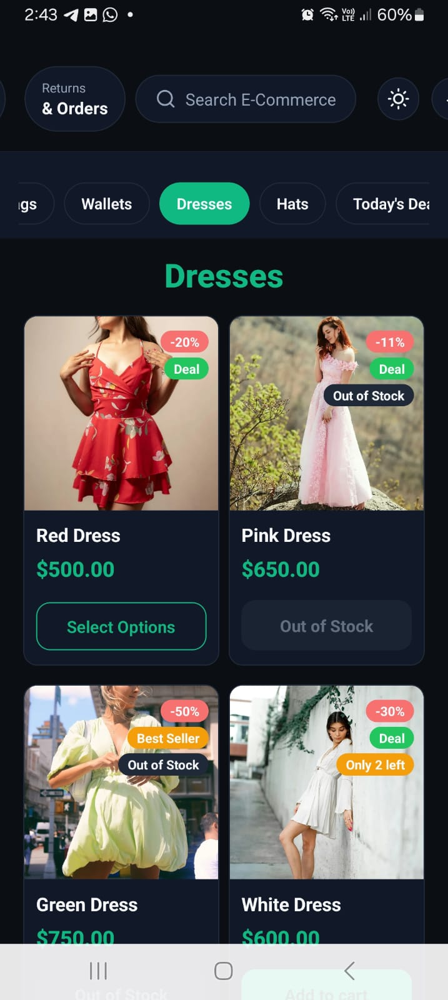 _Category browsing
  with image tiles._
- 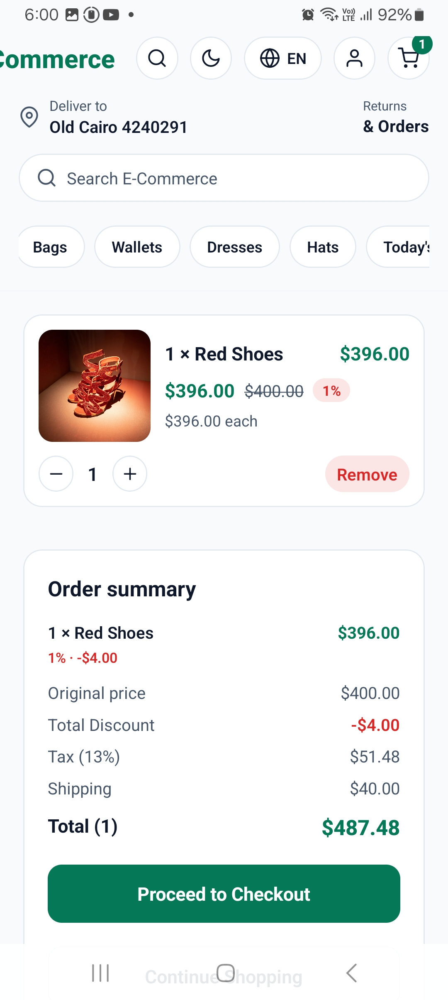 _Cart summary with
  quantity controls._
- 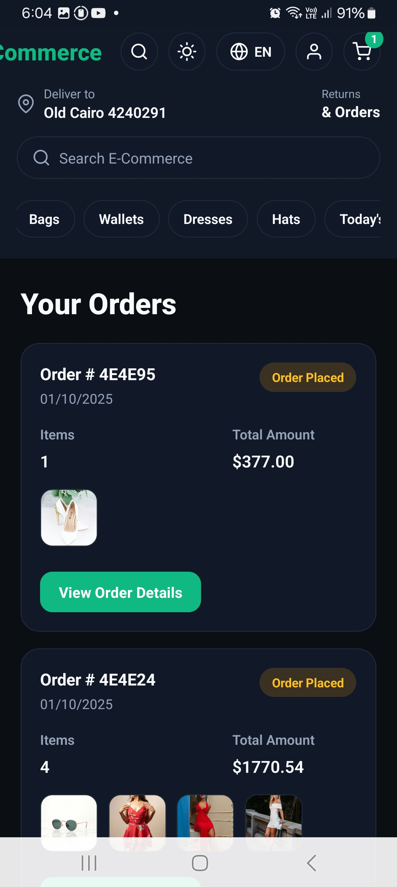 _Past orders
  with status badges._
- 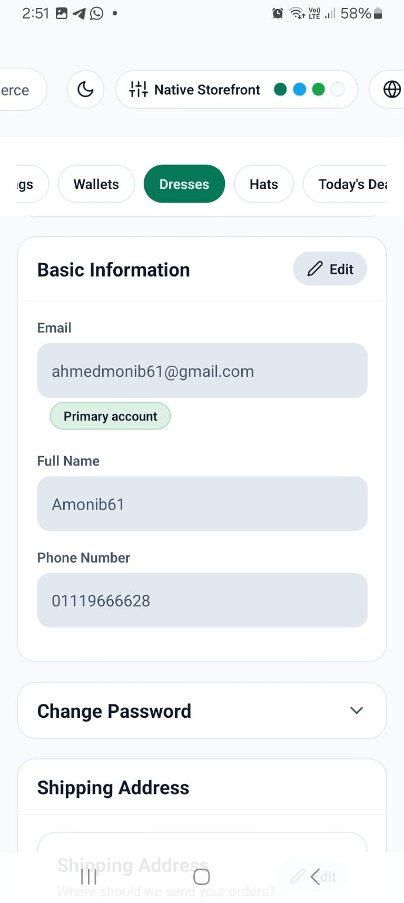 _Profile
  settings including export/delete controls._

---

## What this repo contains

- `frontend/` — React (Vite) app, i18n, Zustand stores, Stripe client, Sentry instrumentation.
- `backend/` — Express API (ESM), Mongoose models, Redis for token storage/caches/locks, Stripe
  webhook handlers, csurf, passport strategies, email helpers. Deployed with the root Dockerfile to
  Railway.
- `mobile/` — Expo + React Native custom dev client with deep-link integration for password reset
  and OAuth flows. See [`mobile/custom-dev-setup.md`](mobile/custom-dev-setup.md).
- `tests/` — Unit/integration/E2E test suites (Jest, supertest, Cypress) and mocks (including
  in-memory Mongo for CI).
- Root Dockerfile + Railway config for container-based API deployments.
- CI workflows for builds and Sentry releases (GitHub Actions).
- Full production-ready features: auth, cart, checkout, admin product & order management, order
  export & printing.

---

## Key features (summary)

- Authentication
  - Short-lived access tokens + rotating refresh tokens stored in Redis (per-device `jti`).
  - Sliding 30-day maximum session window (`session_start:<userId>`).
  - CSRF protection for state-changing endpoints and secure cookie configuration (`SameSite=None`,
    `Secure`, `HttpOnly`).
  - Mobile-aware keep-alive and activity detection to improve session persistence on phones.

- Payments & Orders
  - Stripe Checkout integration with PaymentIntent verification and robust webhook handling.
  - Cart backup and order fallback stored in Redis during checkout.
  - Stock reservation at checkout, atomic DB transactions for decrements, auto-restore on
    cancel/expire/refund.
  - Cash-on-delivery (COD) flow with the same reservation guarantees.

- Products & Inventory
  - Variant support (attributes, per-variant price, per-variant stock, variant images).
  - Admin product flows with variant generation and image management.

- Fulfilment & Admin

- Order listing, status changes, PDF export for fulfilment/labeling, canceled order labeling and
  audit trails.
- **Fully responsive Admin Dashboard** — manage orders, add products, edit variants, and run the
  store from a **phone or tablet** (mobile-friendly layouts and inputs).
- Privacy & Compliance

- GDPR-ready: user data export endpoint and account deletion/anonymization tooling.
- Observability & Security
  - Sentry client & server integration, Winston logging with daily rotation and PII redaction.
  - Rate limiting, input sanitization, NoSQL injection protection.

- Testing
  - Extensive unit/integration/E2E tests with 89.28% backend coverage.

---

## Payment & order flow (detailed)

This section explains the exact runtime flow implemented by the backend payment controller.

### Checkout (Stripe) flow — `createCheckoutSession`

1. **Request validation**
   - Backend receives `products`, `shippingAddress`, `billingAddress`, and optional `phoneNumbers`.
   - Validates addresses and that the cart is non-empty.

2. **Cart backup & fallback**
   - Saves a `cart_backup:<userId>` key in Redis (TTL) so the server can recover cart if the client
     drops off.
   - Creates an `order_fallback:<orderId>` Redis key after creating the order — used as a fallback
     to restore reservations if Stripe session expires.

3. **Order creation (DB transaction)**
   - Loads product metadata (name, price, deal, images, variants) from MongoDB.
   - Computes `subtotal`, `taxAmount` (TAX_RATE), `shippingCost` (SHIPPING_COST), and `totalAmount`.
   - Creates an `Order` document that includes per-item `variantAttributes` (stored as `Map` or
     similar) and persists it inside a Mongo transaction.

4. **Stock reservation**
   - For each order item, calls `reserveStock(productId, quantity, orderId, variantAttributes)`.
   - Reservation logic:
     - Writes a Redis reservation key `stock_reservation:<productId>:<orderId>:<variantKey>` with
       TTL (e.g., 30 minutes).
     - Starts a MongoDB session + transaction and decrements the product or matched variant stock
       atomically.
     - Commits transaction only if decrement succeeds; otherwise aborts and errors bubble back to
       the checkout flow.

5. **Stripe session creation**
   - Builds `line_items` with per-item unit amounts (variant pricing applied if present), plus tax
     and shipping line items.
   - Creates Stripe Checkout session with `metadata` containing `orderId` and `userId`, `expires_at`
     equals reservation TTL, and required `success_url` & `cancel_url`.
   - Updates the `Order` with `stripeSessionId` and `paymentIntentId` from Stripe, and stores order
     fallback info in Redis `order_fallback:<orderId>`.

6. **Commit & response**
   - If all steps succeed, commits the DB transaction and returns the Stripe session ID to the
     client for redirect.

**Result:** stock is reserved server-side, order exists in DB in `order_placed` (or
`cod_order_placed` for COD), and the frontend redirects the user to Stripe Checkout.

---

### Stripe webhooks & async handling — `stripeWebhook`

The webhook handler validates Stripe signatures and supports multiple events:

- **`checkout.session.expired`**
  - Processed asynchronously (background) using `handleExpiredSession(session)`.
  - Actions:
    - Acquire a Redis lock `lock:expire:<orderId>` to avoid race conditions.
    - Restore reserved stock for order by scanning `stock_reservation:*:<orderId>:*` and
      incrementing product/variant stock (via `restoreStockReservation`).
    - Delete the order (`Order.findByIdAndDelete(orderId)`) and clear safety keys (`cart_backup`,
      `order_fallback`).

  - This guarantees reserved inventory returns to stock if the checkout is abandoned.

- **`checkout.session.completed`**
  - Reads `session.metadata.orderId` and `userId`.
  - Clears backup safety keys.
  - Optionally fetches Stripe PaymentIntent to determine authoritative payment status (handles 3DS
    and other async flows).
  - If payment succeeded (`succeeded` / `paid`):
    - Performs optional final checks (extra stock verification).
    - Keeps paid card orders in `order_placed` (paid but awaiting fulfilment) — fulfillment status
      is separate.
    - Sends confirmation email if not already sent.

  - If a PaymentIntent indicates final failure (`canceled`, `failed`) then:
    - Marks order as `payment_failed`, restores stock, and sets failure reason.

- **`charge.refunded`**
  - If a full refund is detected for a payment intent related to an order:
    - Sets `order.status = 'refunded'`, persists `refundId`, updates timestamps.
    - Restores inventory via `restoreStockReservation(order._id)`.

> All webhook processing logs heavily and attempts safe recovery. Non-critical failures (e.g.,
> email) are logged but don't crash the handler.

---

### COD flow (Cash-on-Delivery) — `createCODOrder` & `codCheckoutSuccess`

- `createCODOrder` follows almost the same path as Stripe checkout: validate payload, compute
  totals, create an `Order` (status `cod_order_placed`), reserve stock (variant-aware), and return
  order id and totals to the client.
- `codCheckoutSuccess` accepts `orderId`, verifies user ownership, clears cart and safety keys,
  sends confirmation email (if not sent), and returns order summary to the client.

---

### Stock reservation & restoration (variant-aware)

- Reservations are stored as Redis keys with structure:

  ```
  stock_reservation:<productId>:<orderId>:<variantKey>
  ```

  where `<variantKey>` is a stable JSON string of variant attributes (so attribute order doesn't
  break matching).

- `reserveStock`:
  - Saves Redis reservation (TTL \~ 30 min).
  - Opens Mongo transaction and decrements either `product.stock` or `variants.$.stock` for the
    matched variant.

- `restoreStockReservation`:
  - `KEYS stock_reservation:*:<orderId>:*` (production should use `SCAN` for large keyspaces) to
    find reservations.
  - Builds `bulkWrite` ops to increment product or variant stock back by reservation quantity, and
    deletes reservation keys after update.
  - Works with variant attribute matching via `arrayFilters` in Mongo bulk ops.

---

### Failure & expired session handling

- If any step fails before Stripe session creation, the transaction is aborted and the client
  receives a `400`/`500` error (with friendly messages).
- If Stripe session expires without payment:
  - Webhook triggers `handleExpiredSession`, which restores stock, deletes the incomplete order, and
    clears safety keys.
  - Because reservations use Redis keys and the DB update is atomic, this avoids double-selling.

- If a PaymentIntent partially or fully fails after session completion:
  - PaymentIntent inspection in the webhook marks `payment_failed` and restores inventory if
    appropriate.

---

## Products, variants & model behavior

- Products support:
  - Multiple languages for textual fields (e.g., `name.en`, `name.ar`).
  - `images` (array) and per-variant `image` override.
  - `price` and per-variant `price` override.
  - `stock` (global) and per-variant `stock`.
  - `deal` (discount percentage) applied to item price calculation.

- Variants:
  - Stored as objects with `attributes` (Map-like), `price`, `stock`, and optional `image`.
  - Matching helper `findMatchingVariant(product, variantAttributes)` is used widely to:
    - Determine per-item price on checkout and line items.
    - Decrement / increment the exact variant stock on reserve/restore.

- The frontend displays variant-specific price and stock and adds per-variant images when available.

- Product badges:
  - **Deal**, **Best Seller**, **New Release** badges.
  - **Stock badge**: shown when stock ≤ 5.
  - **Discount badge**: supports discount values from **1% to 80%**.

- Ability to **hide** items from the UI (instead of deleting) so you can retain product data and
  reinstate when restocked.

---

### Product creation & image upload pipeline (frontend → backend → Cloudinary)

This project implements a **robust, rate-limit-friendly** image flow for both product creation and
editing. It works the same in local dev and production (Railway).

#### 1) Frontend (Create / Edit Product forms)

- Users can attach up to **10 gallery images** (`images[]`) and optional **per-variant images**
  (`colorImages[]`).
- When variants include a Color attribute, the form pairs each uploaded variant image with a
  **`colorKeys`** string (one per file), so the backend can map it to the correct variant.
- All data is submitted as `multipart/form-data`:
  - `name.*`, `description.*`, `category.*` (multi-lang fields)
  - `price` (base product price)
  - `images` (0—10 gallery images)
  - `variants` (JSON of the variant grid with attributes/stock/price)
  - `colorImages` (0—N files, one per colored variant you want an override image for)
  - `colorKeys` (0—N strings, aligned to `colorImages`)
- **Editing** additionally sends:
  - `keepImages` — array of existing gallery URLs that should stay
  - `keepVariantImages` — array (by variant index) of URLs (or `null`) to keep/clear

> Frontend uses a generous Axios timeout to accommodate 10-image batches. Gallery/variant files are
> appended individually; the backend processes them **sequentially** to avoid burst limits.

#### 2) Upload middleware (backend)

`backend/src/middleware/upload.middleware.js`

- Uses **Multer** with disk storage:
  - Destination: `UPLOADS_BASE_DIR` (env) — defaults to `uploads` at project root
  - Safe filename format: `${Date.now()}-<uuid>.<ext>`
  - **Type guard**: only `jpeg/jpg/png/webp` allowed
  - **Limits**: `files: 20`, `fileSize: MAX_UPLOAD_MB` (env, default `25MB`)
- After the request passes the middleware, `req.files` contains all uploaded files ready for
  processing.

#### 3) Image processing (Sharp)

`backend/src/utils/imageProcessor.js`

- Converts each raw upload to an optimized **WebP**:
  - `800x800` **cover** crop, then `toFormat('webp')`
  - Writes to **`uploads/products/`** (folder ensured if missing)
  - Removes the **original raw** temp file
  - Returns the **filename** (e.g., `product-<uuid>.webp`)

> Design note: We always write to `uploads/products` locally (even in production) as a **temporary
> processing step**; the system of record is **Cloudinary**.

#### 4) Cloudinary upload & cleanup

In `product.controller.js` we use a single helper:

- `processAndUpload(file)`:
  1. Calls `processProductImage(file)` → get processed WebP filename
  2. Uploads `<UPLOADS_BASE_DIR>/<PRODUCT_IMAGES_DIR>/<filename>` to Cloudinary
     - `folder: CLOUDINARY_FOLDER` (defaults to `products`)
     - `resource_type: 'image'`, `unique_filename: true`, `overwrite: false`
  3. **Deletes** the processed WebP after upload
  4. Returns `secure_url`
- **Sequential** uploads (for both gallery and variant images) avoid Cloudinary rate-limit spikes
  and make 10-image batches reliable on slower networks.
- A best-effort `cleanupTempUploads(req.files)` runs in `finally{}` to remove any Multer temps.

#### 5) Variants & image mapping

**Create** (`POST /api/products`):

- Gallery: every file in `images` → `processAndUpload` → push to `product.images`.
- Variants:
  - Parse `variants` JSON (attributes/stock/price per row).
  - If `colorImages` provided, pair **index-aligned** `colorKeys` to build a `colorToUrl` map (e.g.,
    `{ "Red": <url>, "Blue": <url> }`).
  - For each variant, if it has a `Color` (or `color`) attribute, set
    `variant.image = colorToUrl[color]` when present.
  - **No gallery images?** Seed gallery from the `colorToUrl` values so the product still has
    images.

**Edit** (`PUT /api/products/:id`):

- **Deletes** Cloudinary images that are _not_ listed in `keepImages`.
- Uploads any new `images`, then sets `product.images = [...keepImages, ...newUrls]`.
- For variants: uploads new `colorImages` and maps them to attributes like create; otherwise uses
  the corresponding `keepVariantImages[idx]` value.

#### 6) Storage of record

- The **authoritative** product image URLs live in MongoDB (`product.images` and `variant.image`).
- The **only** persistent storage for image binaries is **Cloudinary**. The `uploads/` folder is
  **ephemeral** (processing temp).

#### 7) Environment (what to set)

- **Backend (Railway / local)**

  ```env
  # Cloudinary credentials
  CLOUDINARY_CLOUD_NAME=...
  CLOUDINARY_API_KEY=...
  CLOUDINARY_API_SECRET=...
  # Upload pipeline
  UPLOADS_BASE_DIR=uploads           # temp processing base dir (no leading ./ in prod)
  PRODUCT_IMAGES_DIR=products        # temp subfolder for processed webp files
  CLOUDINARY_FOLDER=products         # Cloudinary target folder
  MAX_UPLOAD_MB=25                   # per-file limit enforced by Multer
  ```

- **CSP** (already configured): `img-src` allows `https://res.cloudinary.com` so images render in
  all environments.

#### 8) Operational notes

- **Batch size**: 10 gallery images (plus per-variant images) are supported; uploads run
  **sequentially** to avoid rate-limit bursts.
- **Timeouts**: The frontend Axios instance uses extended timeouts for create/edit product calls to
  accommodate slower networks + large images.
- **Safety**: Any Multer temp that somehow survives processing is cleaned in a `finally{}` block.
- **Editing deletions**: When an admin removes a gallery image, the backend issues a
  `cloudinary.uploader.destroy("products/<publicId>")` before saving the new list.

> TL;DR — Drop up to 10 images (+ optional per-variant images), the backend processes to WebP,
> uploads to Cloudinary (one by one), cleans temp files, and persists Cloudinary URLs on the
> product.

## Auth & session persistence — how it works (plain language)

- Upon login/signup the server issues:
  - `access token` cookie, short-lived (e.g., 15 minutes).
  - `refresh token` cookie, long-lived (sliding, e.g., up to 30 days).
  - Server stores the refresh token value keyed by `refresh_token:<userId>:<jti>` in Redis.
  - A `session_start:<userId>` key is set in Redis to implement a **maximum sliding lifetime**
    (default 30 days).

- Token rotation:
  - `/api/auth/refresh-token` validates the cookie against Redis and atomically rotates to a new
    `jti` to prevent reuse of stolen tokens.

- Sliding window:
  - Each successful refresh or keep-alive `EXPIRE`s the `session_start:<userId>` key for another 30
    days.
  - If a user is inactive for 30 days (no refresh / keep-alive), `session_start` expires — server
    rejects further refreshes and requires re-login.

- Mobile friendliness:
  - Frontend implements mobile-aware keep-alive intervals and additional activity listeners
    (touchstart, focus) to counteract mobile background throttling.
  - The server provides both `/auth/refresh-token` and `/auth/keep-alive` paths — keep-alive
    refreshes cookie TTLs and can issue a fresh access token.

**UX rule implemented:** sessions persist for up to 30 days of inactivity; any visit/activity
refreshes the 30-day window.

---

## Order fulfilment, PDF export & canceled order labeling

- Admin UI supports exporting order details to PDF for fulfilment and label printing. Export
  includes order lines, shipping address, and order metadata.
- Canceled orders are explicitly labeled in the admin (status `cancelled` / `payment_failed` /
  `refunded`) and included in exports as such for tracking.
- PDF export utility is implemented server-side (PDF generation libraries) and exposed to the admin
  for download/printing.

---

## GDPR & user data export

- Users can request their data export via the `exportUserData` endpoint. Export includes orders,
  profile, and related user metadata in JSON format.
- Account deletion/anonymize flow:
  - When requested, PII is removed/anonymized and orders are either retained as anonymized records
    or deleted per config/policy.

- The system provides audit logging and an admin review path for data exports to comply with privacy
  regulations.

---

## Security & observability

- Cookies: `HttpOnly`, `Secure`, `SameSite=None` (when cross-site), and domain configured to allow
  cross-subdomain cookies for frontend + API.
- CSRF protection enabled for state-changing endpoints (`/api/csrf-token` endpoint available).
- Rate limiting on auth endpoints and refresh endpoint.
- Sanitization and NoSQL injection protection for request bodies and query params.
- Logging: Winston with daily rotation, sensitive data redaction, and optional Sentry forwarding for
  uncaught exceptions and errors.

---

## Testing & CI

- Tests: Jest unit & integration tests with mocks for Redis / email / cloudinary, supertest for
  route-level tests, and Cypress for frontend E2E flows.
- Coverage: Backend coverage is reported at **89.28%** (unit + integration).

### How to run tests

- **Unit + integration**:

  ```bash
  # From backend/
  npm run test
  ```

- **E2E (configured Jest e2e runner)**:

  ```bash
  # From backend/
  npm run test:e2e
  ```

- **Run coverage report**:

  ```bash
  npm run test:coverage
  ```

- **Watch tests** (dev):

  ```bash
  npm run test:watch
  ```

- **Debug tests**:

  ```bash
  npm run test:debug
  ```

> The test suite uses `NODE_ENV=test` and in many places relies on an in-memory Mongo test server
> (MongoMemoryServer) and a mocked Redis in CI. Ensure the test environment can start the in-memory
> Mongo (no other DB required for tests).

### Test status

- **Coverage:** Backend test coverage: ~89% (unit + integration). Full test suite includes
  authorization flows, stock reservation, Stripe webhooks, and end-to-end checkout scenarios —
  automated in CI with deterministic mocks for external services.

---

## How to run locally (no Docker)

> Local setup does **not** require Docker. Use local MongoDB & Redis, or managed services.

1. Clone and install:

```bash
# from repo root
cd backend
npm ci

cd ../frontend
npm ci
```

2. Create `.env` files:

- `backend/.env` — list of env variables (see the list below), **do not** commit secrets to repo.
- `frontend/.env` — `VITE_API_BASE_URL` pointing at your backend (e.g.,
  `http://localhost:5000/api`).

3. Start backend:

```bash
cd backend
npm run dev
```

4. Start frontend:

```bash
cd frontend
npm run dev
```

5. Visit the frontend URL printed by Vite (commonly `http://localhost:5173`).

---

### Local HTTPS for development (optional but recommended)

This project can run the backend locally over **HTTPS** to better mimic production (certs are stored
under `backend/cert/` in this repo). If you enable HTTPS you will typically open the backend URL
first and accept the certificate in your browser; afterwards open the frontend at
`https://localhost:5173`.

**Quick note:** you can instead open **`https://localhost:5000`** (your backend) in the browser and
accept the certificate there **before** opening **`https://localhost:5173`** — accepting the cert
for the backend often prevents browser warnings when you then visit the frontend dev server.

1. **Recommended (mkcert)** — easiest, trusted CA for local development

```bash
# install mkcert (example: macOS/Homebrew)
brew install mkcert nss
mkcert -install

# generate SAN cert files used by the server (writes to backend/cert/)
mkcert -key-file backend/cert/localhost2-key.pem \
       -cert-file backend/cert/localhost2.pem \
       localhost 127.0.0.1 ::1 www.localhost
chmod 600 backend/cert/localhost2-key.pem
```

2. **OpenSSL (manual alternative)** — create a SAN cert without mkcert

```bash
cat > san.cnf <<'EOF'
[req]
distinguished_name = req_distinguished_name
x509_extensions = v3_ca
prompt = no

[req_distinguished_name]
CN = localhost

[v3_ca]
subjectAltName = @alt_names

[alt_names]
DNS.1 = localhost
DNS.2 = 127.0.0.1
DNS.3 = ::1
DNS.4 = www.localhost
EOF

openssl req -x509 -nodes -newkey rsa:2048 \
  -keyout backend/cert/localhost2-key.pem \
  -out backend/cert/localhost2.pem \
  -days 825 -config san.cnf
chmod 600 backend/cert/localhost2-key.pem
```

3. **Trust the cert (make browser accept it)**

Use the OS-specific commands below to add the generated certificate to the system/browser trust
store so browsers accept `https://localhost:5000` and `https://localhost:5173` without warnings.

- **macOS**

```bash
sudo security add-trusted-cert -d -r trustRoot -k /Library/Keychains/System.keychain backend/cert/localhost2.pem
```

- **Ubuntu / Debian**

```bash
sudo cp backend/cert/localhost2.pem /usr/local/share/ca-certificates/localhost2.crt
sudo update-ca-certificates
```

- **Fedora / RHEL**

```bash
sudo trust anchor --store backend/cert/localhost2.pem
```

- **Windows (Admin PowerShell)**

```powershell
# Add to LocalMachine\Root
Import-Certificate -FilePath .\backend\cert\localhost+2.pem -CertStoreLocation Cert:\LocalMachine\Root
```

If you used `mkcert` (recommended) it will automatically install the CA into the system/browser
stores for you. After trusting the cert, restart your browser.

**Restart servers:** after replacing cert files restart the backend dev server (nodemon will usually
pick changes; otherwise `npm run dev` from repo root).

---

---

## Environment variables used

**Authentication & cookies**

```
ACCESS_TOKEN_EXPIRE
ACCESS_TOKEN_SECRET
REFRESH_TOKEN_EXPIRE
SESSION_SECRET
SESSION_REDIS_PREFIX
REFRESH_TOKEN_SECRET
MAX_SESSION_LIFETIME_DAYS
COOKIE_DOMAIN
CSRF_SECRET
COOKIE_SECRET
DEBUG_REFRESH
```

**Application URLs**

```
CLIENT_URL
SERVER_URL
DEV_ORIGIN
PRODUCTION_ORIGIN
VITE_API_BASE_URL (frontend)
VITE_CLIENT_BASE_URL (frontend)
```

**Database & cache**

```
MONGO_URI
UPSTASH_REDIS_URL (or REDIS connection string)
```

**Third-party services**

```
STRIPE_SECRET_KEY
STRIPE_WEBHOOK_SECRET
SENDGRID_API_KEY
CLOUDINARY_CLOUD_NAME
CLOUDINARY_API_KEY
CLOUDINARY_API_SECRET
SENTRY_DSN
SENTRY_RELEASE
```

**Social logins & callbacks**

```
FACEBOOK_APP_ID
FACEBOOK_APP_SECRET
FACEBOOK_CALLBACK_URL
FACEBOOK_LINK_CALLBACK_URL
GOOGLE_CLIENT_ID
GOOGLE_CLIENT_SECRET
GOOGLE_CALLBACK_URL
GOOGLE_LINK_CALLBACK_URL
```

**Application settings**

```
PORT
NODE_ENV
VITE_TAX_RATE
VITE_SHIPPING_COST
UPLOADS_BASE_DIR         # temp processing base dir (e.g., "uploads")
PRODUCT_IMAGES_DIR       # temp subdir for processed webp (e.g., "products")
CLOUDINARY_FOLDER        # Cloudinary folder for final assets (e.g., "products")
MAX_UPLOAD_MB            # Multer per-file size limit in MB (default 25)
COOKIE_DOMAIN
USE_HTML_REDIRECT

```

Remember to configure these per environment (Railway, Vercel, local).

---

### Example `.env` for local development (copy & fill)

Below are **copy-ready** example files for local development. Put the backend block in
`backend/.env` and the frontend block in `frontend/.env`.

**backend/.env (local dev example)**

```env
# Server
NODE_ENV=development
PORT=5001
CLIENT_URL=https://localhost:5173
SERVER_URL=https://localhost:5001
DEV_ORIGIN=https://localhost:5173,https://localhost:3000
COOKIE_DOMAIN=
ENFORCE_HTTPS=false
TRUST_PROXY=false
FORCE_SECURE_COOKIES=false

# Database
MONGO_URI=mongodb://localhost:27017/your-db-name

# Redis (Optional)
UPSTASH_REDIS_URL=

# JWT / Auth
ACCESS_TOKEN_SECRET=changeme_access_secret
REFRESH_TOKEN_SECRET=changeme_refresh_secret
SESSION_SECRET=changeme_session_secret
SESSION_REDIS_PREFIX=session:
ACCESS_TOKEN_EXPIRE=15m
REFRESH_TOKEN_EXPIRE=7d
MAX_SESSION_LIFETIME_DAYS=30
CSRF_SECRET=changeme_csrf
COOKIE_SECRET=changeme_cookie_secret
JWT_SECRET=changeme_jwt_secret
DEBUG_REFRESH=false

# OAuth Providers
GOOGLE_CLIENT_ID=
GOOGLE_CLIENT_SECRET=
GOOGLE_CALLBACK_URL=http://localhost:5001/api/auth/google/callback
GOOGLE_LINK_CALLBACK_URL=http://localhost:5001/api/auth/google/link/callback
FACEBOOK_APP_ID=
FACEBOOK_APP_SECRET=
FACEBOOK_CALLBACK_URL=http://localhost:5001/api/auth/facebook/callback
FACEBOOK_LINK_CALLBACK_URL=http://localhost:5001/api/auth/facebook/link/callback

# Stripe
STRIPE_SECRET_KEY=
STRIPE_WEBHOOK_SECRET=

# Email Service (SendGrid)
SENDGRID_API_KEY=
SENDGRID_FROM_EMAIL=your-email@example.com
SENDGRID_FROM_NAME="Ecommerce store"
SUPPORT_EMAIL=your-support@example.com

# Cloudinary
CLOUDINARY_CLOUD_NAME=
CLOUDINARY_API_KEY=
CLOUDINARY_API_SECRET=

# Sentry
SENTRY_DSN=
SENTRY_RELEASE=backend@local

# File uploads / pricing
UPLOADS_BASE_DIR=uploads # use bare path (no ./) to match prod
PRODUCT_IMAGES_DIR=products
CLOUDINARY_FOLDER=products
TAX_RATE=0.14
SHIPPING_COST=70
# optionally raise this if you use very large originals
MAX_UPLOAD_MB=25

# Local HTTPS cert usage flags (optional)
USE_LOCAL_HTTPS=true
LOCAL_CERT_PATH=./cert/localhost2.pem
LOCAL_KEY_PATH=./cert/localhost2-key.pem
```

**frontend/.env (local dev example for Vite)**

```env
VITE_API_BASE_URL=https://localhost:5001
VITE_CLIENT_BASE_URL=https://localhost:5173
VITE_KEEPALIVE_INTERVAL_MS=300000
VITE_STRIPE_PUBLISHABLE_KEY=
VITE_SENTRY_DSN=
VITE_SENTRY_RELEASE=frontend@local
VITE_SENTRY_TRACES_SAMPLE_RATE=0.1
VITE_TAX_RATE=0.14
VITE_SHIPPING_COST=70
```

Notes:

- Keep secrets out of source control — commit only `.env.example` with placeholders.
- If you run backend locally over HTTPS (see "Local HTTPS for development" above), set
  `USE_LOCAL_HTTPS=true` and ensure the `LOCAL_CERT_PATH` / `LOCAL_KEY_PATH` point to the cert files
  (or let server code load `backend/cert/localhost+2.pem` by default).

---

### Deployment platform variables (Railway / Vercel)

The README already lists the primary deployment variables in groups. To be explicit:

- **Railway / server-side**: populate the backend keys shown in `backend/.env` (MONGO*URI, REDIS,
  STRIPE*\_, SENDGRID\_\_, SENTRY\_\*, CALLBACK URLs, COOKIE_DOMAIN, etc.) in Railway's environment
  variables panel.
- **Vercel / frontend**: populate the `VITE_*` variables (API base, stripe publishable key, Sentry
  keys, client base URL and any feature flags).

## Redis debugging quick commands

Use `redis-cli` or your managed Redis console:

```bash
# connect (example)
redis-cli -h 127.0.0.1 -p 6379

# Check TTL for session_start
TTL session_start:<userId>

# Get refresh token stored server-side (debug only)
GET refresh_token:<userId>:<jti>

# Reservation keys
KEYS stock_reservation:*:<orderId>:*

# Cart backup
GET cart_backup:<userId>
```

> In production prefer `SCAN` instead of `KEYS` to avoid blocking.

---

## Screenshots

> Admin panel screenshots (admin access required)

### Orders & Fulfilment

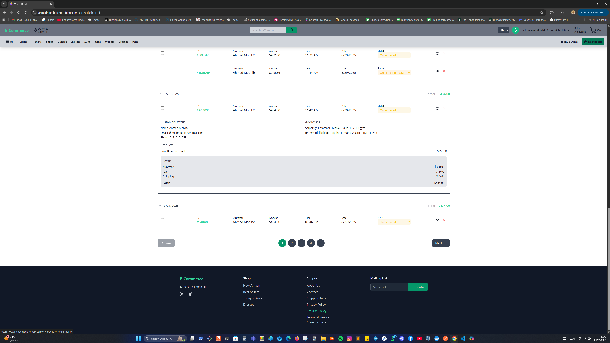 _Orders list with
pagination._

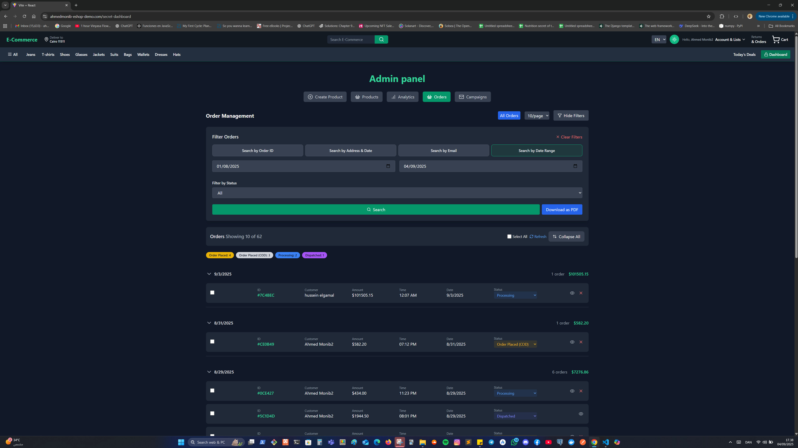 _Orders list (dark
theme)._

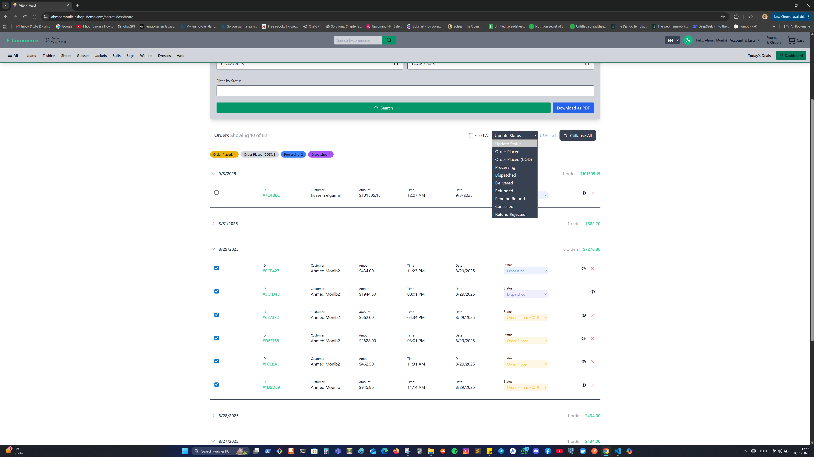
_Bulk update order statuses (multi-select)._

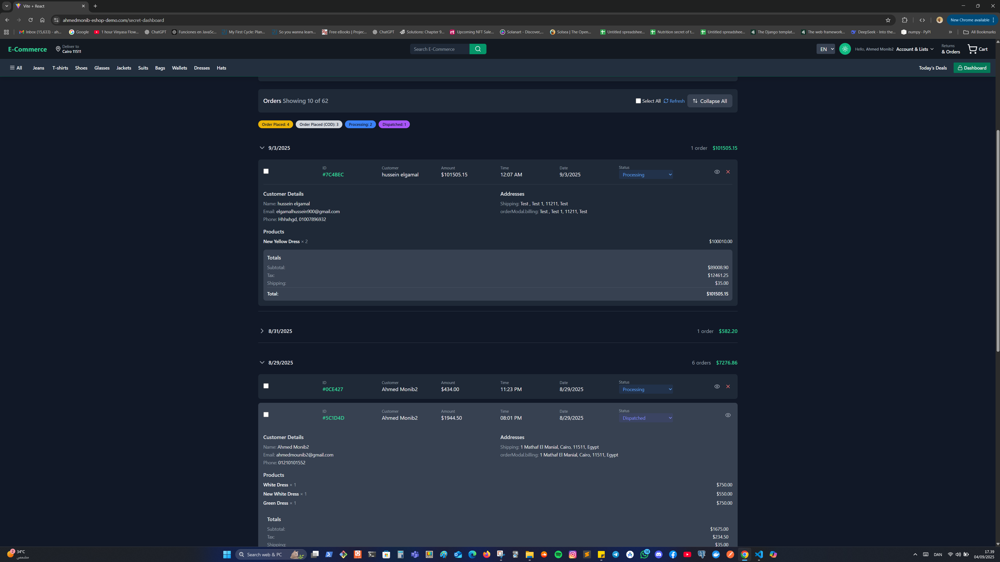
_Expanded order row showing details (light theme)._

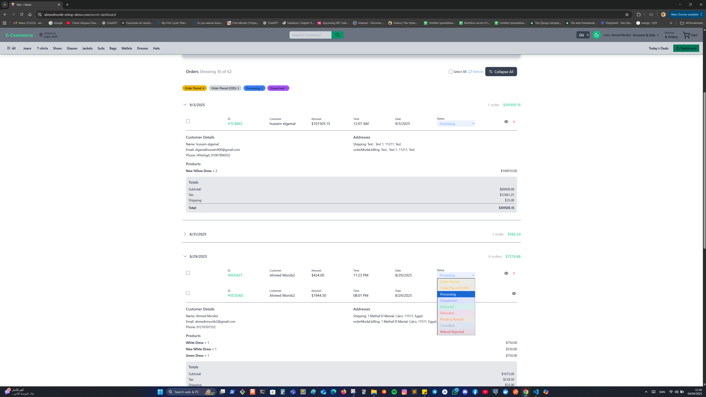
_Expanded order with status change controls (light theme)._

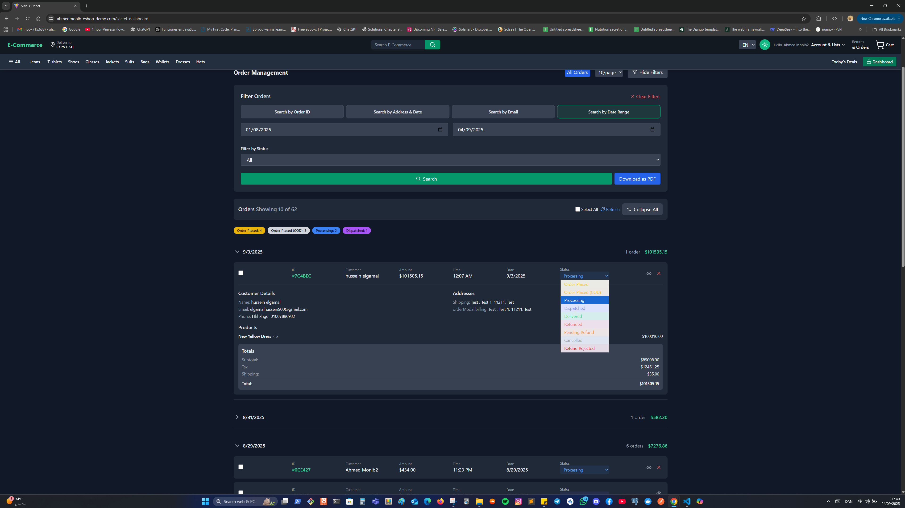
_Expanded order with status change controls (dark theme)._

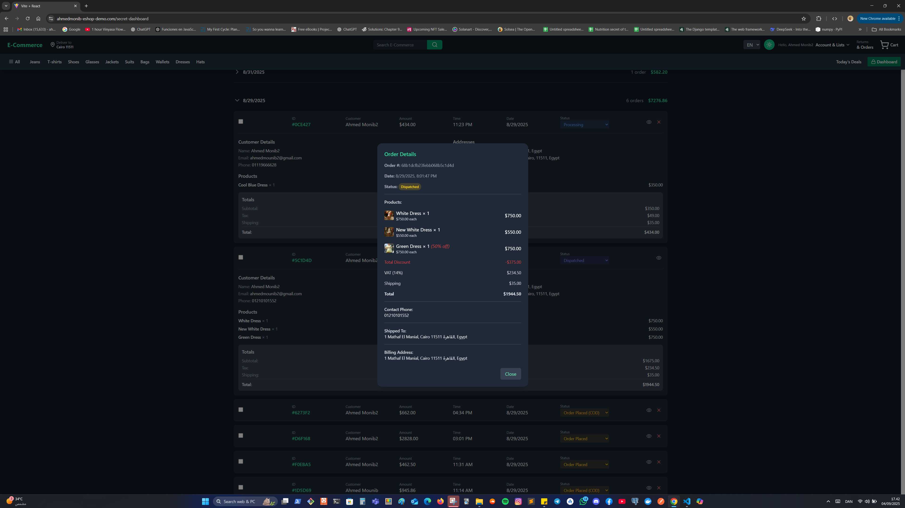
_Expanded order with customer view (dark theme)._

---

### Create Product & Variants

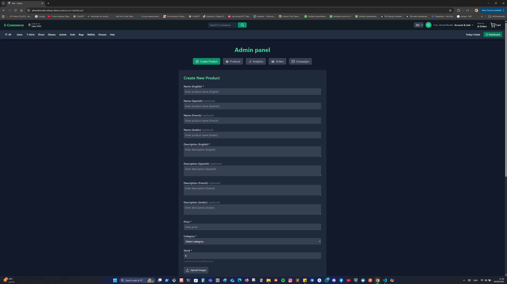 _Admin UI —
Create product (base fields)._


_Admin UI — Create product with variants (light theme)._

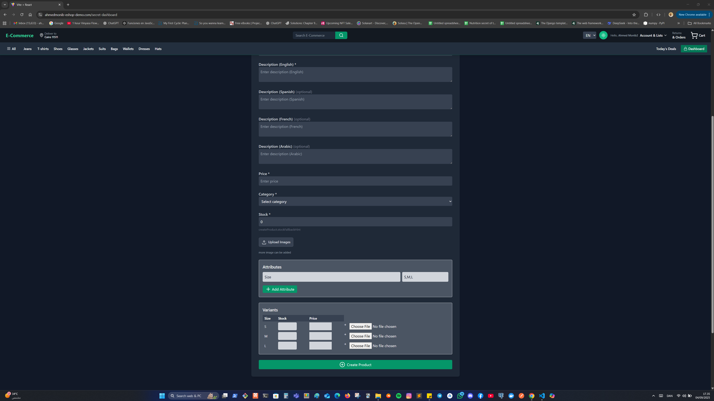
_Admin UI — Create product with variants (dark theme)._

---

### Analytics & Campaigns

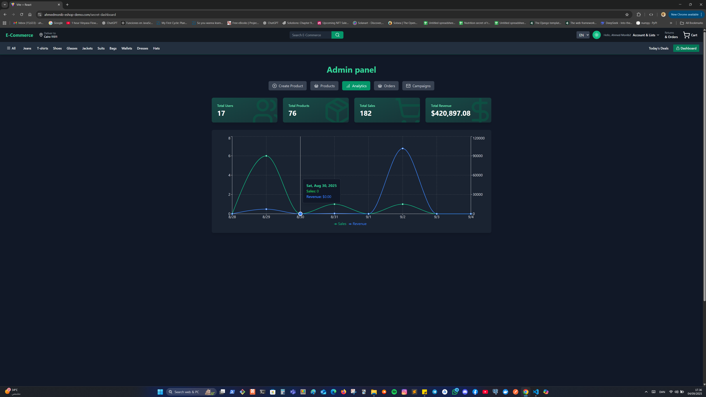 _Admin
analytics dashboard — sales, users, revenue._

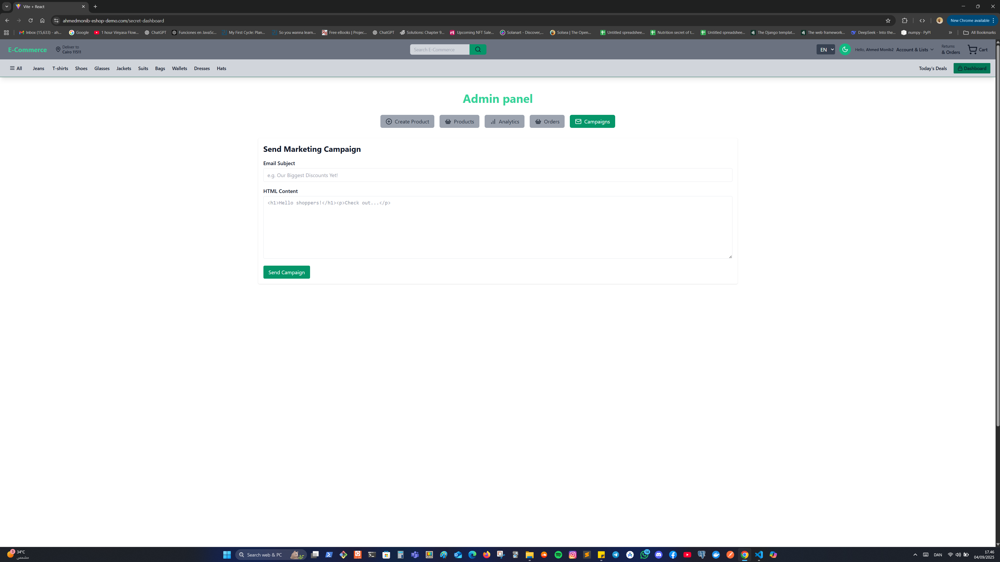 _Marketing campaigns / mailing list
management._

---

### Emails

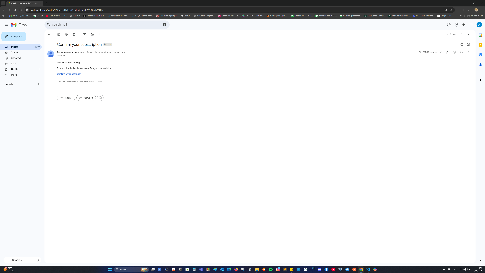
_Email campaign subscription confirmation email._

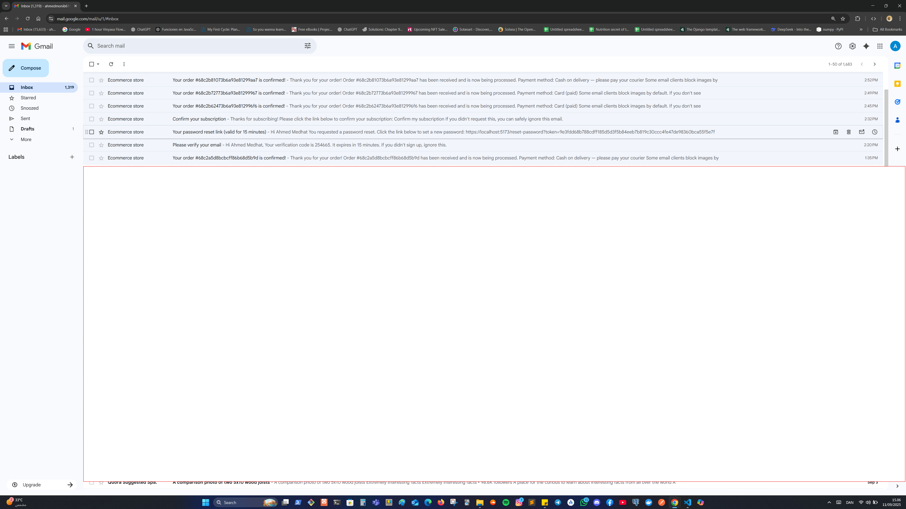 _Emails
successfully delivered to inbox (not marked as spam)._

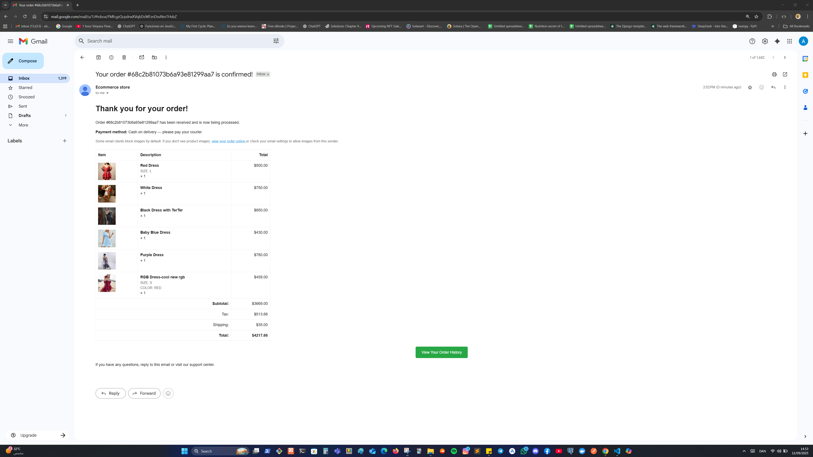
_Order confirmation email for cash-on-delivery orders with product variants._


_Order confirmation email for paid orders with product variants._

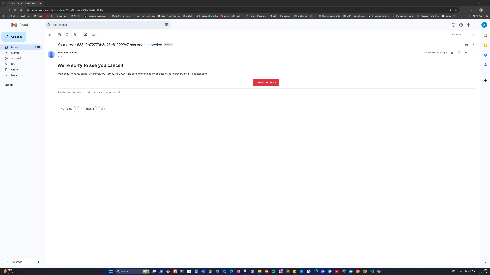
_Order cancellation confirmation email._

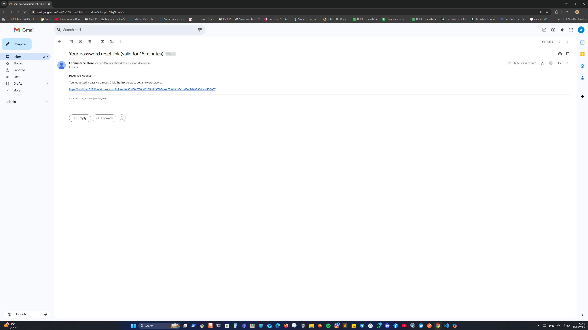 _Password reset link
email._

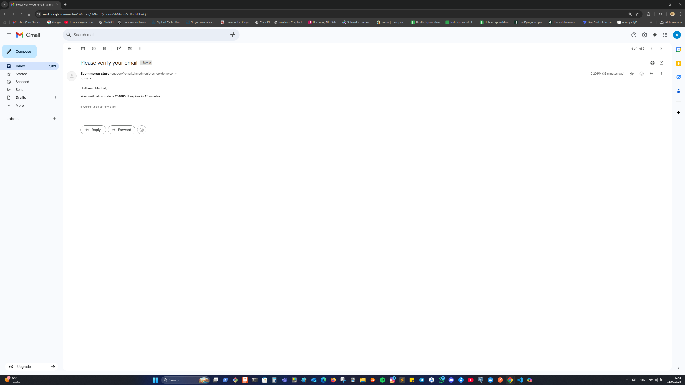 _Local signup Email verification
request email._

---

### Mobile

 _Native home screen with
featured sliders._

 _Category browsing
with hero banners._

 _Cart summary with
variant chips and quantity controls._

 _Order history
with status tracking._

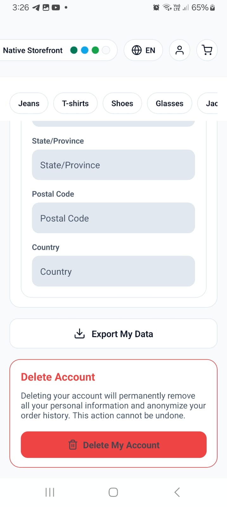
_Profile management, GDPR export, and delete account actions._

## Commercial license (proprietary) & selling notes

Check LICENSE_PROPRIETARY.txt

**Selling notes**:

- Deliverables to include: source code, deployment scripts, environment setup, 30 days of
  post-delivery support, documentation, and optional maintenance plan.
- For buyers: the app is horizontally scalable — to increase capacity, upgrade MongoDB/Redis/hosting
  plans and scale server replicas behind a load balancer.

---

## Contact / commercial enquiries

## Mobile app download placeholder

Use this section once the Android build is live:

- **Google Play (production)** — _Add the public Play Store link here once approved._
- **QR code** — _Embed a QR image or markdown link here so testers can scan and download the
  APK/AAB._

For pre-release distribution you can temporarily link to an Expo build or internal testing track.

---

## Demo credentials (web & mobile)

All credentials are scoped to the staging environment (`https://www.ahmedmonib-eshop-demo.com` and
the Expo mobile client). Update or rotate as needed before sharing broadly.

| Role            | Email / Username         | Password |
| --------------- | ------------------------ | -------- |
| Admin           | `ahmedmonib61@gmail.com` | `123456` |
| Regular shopper | `amonib831@gmail.com`    | `123456` |

> ⚠️ **Security note:** These accounts are for evaluation only. Reset or disable them prior to
> handing the codebase to a paying client.

---

For purchase, licensing, deployment assistance, or a demo with admin credentials contact:
**[ahmedmounib2@gmail.com](mailto:ahmedmounib2@gmail.com)**

---
