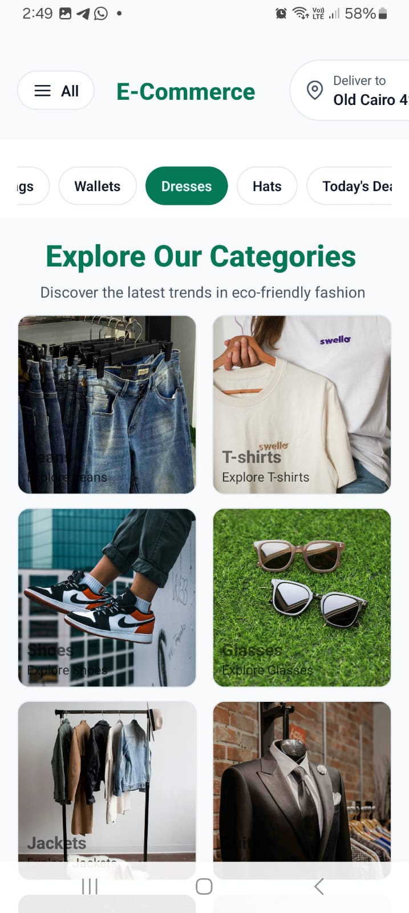
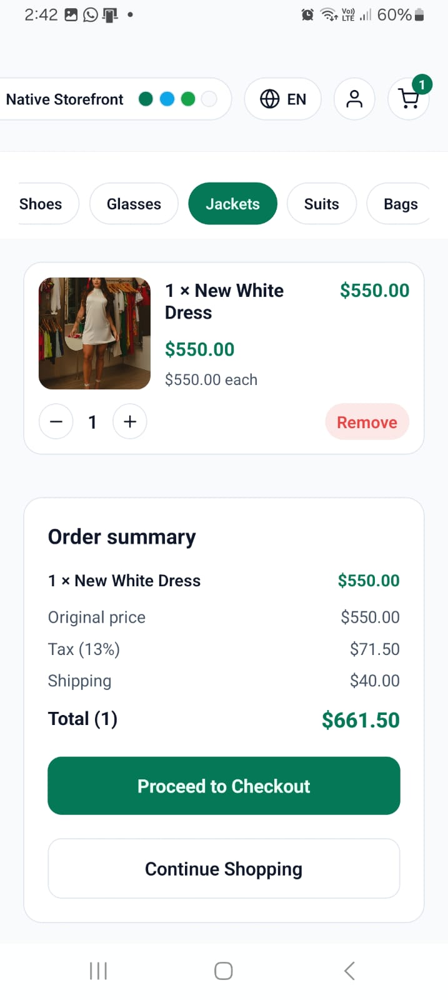
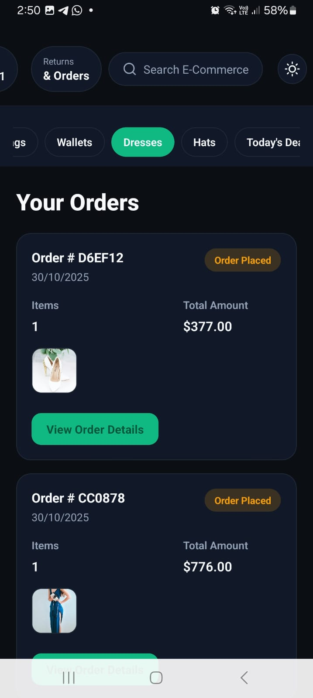
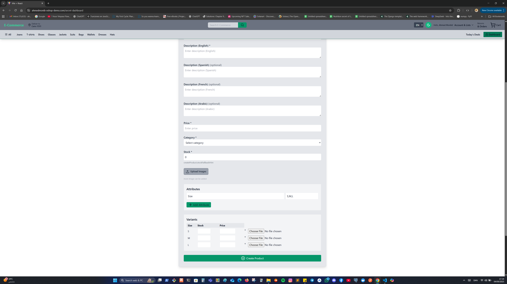

# AhmedMonib E-Shop — Enterprise-Grade E-commerce Shop

> Production-ready, enterprise-grade e-commerce storefront (React + Vite frontend, Node.js + Express
> backend) with:
>
> - Secure rotated refresh tokens and sliding 30-day sessions (mobile-aware keep-alive)
> - Product variants, per-variant stock & pricing, cart reservation and automatic stock restore on
>   cancel/expire
> - Stripe Checkout integration with robust webhook handling (PaymentIntent verification, refunds,
>   expired sessions)
> - Order export (PDF) & fulfilment tooling, GDPR data export, Sentry observability, and 89.28% test
>   coverage.

---

## Table of contents

- [AhmedMonib E-Shop — Enterprise-Grade E-commerce Shop](#ahmedmonib-e-shop--enterprise-grade-e-commerce-shop)
  - [Table of contents](#table-of-contents)
  - [Maintainer context](#maintainer-context)
  - [One-line pitch](#one-line-pitch)
  - [Live demo \& hosted domains](#live-demo--hosted-domains)
  - [Mobile app download links](#mobile-app-download-links)
  - [Monorepo architecture \& workspaces](#monorepo-architecture--workspaces)
    - [Workspaces](#workspaces)
    - [Common scripts](#common-scripts)
    - [Environment references](#environment-references)
    - [Multi-store / multi-tenant foundations (Sprint 00)](#multi-store--multi-tenant-foundations-sprint-00)
    - [Seller onboarding flow (design \& implementation)](#seller-onboarding-flow-design--implementation)
      - [Entry points \& UX design](#entry-points--ux-design)
      - [Data model design (Seller + Store)](#data-model-design-seller--store)
      - [API flow (step-by-step)](#api-flow-step-by-step)
      - [State machine (clear, enforced transitions)](#state-machine-clear-enforced-transitions)
      - [Security \& ownership controls](#security--ownership-controls)
      - [Post-approval seller experience](#post-approval-seller-experience)
      - [Operational notes](#operational-notes)
    - [Seller store settings, storefront policies, and admin review flow](#seller-store-settings-storefront-policies-and-admin-review-flow)
      - [Seller settings: editable fields \& review gates](#seller-settings-editable-fields--review-gates)
      - [What happens when a seller updates policies or branding](#what-happens-when-a-seller-updates-policies-or-branding)
      - [Admin review workflow (store profile + policy updates)](#admin-review-workflow-store-profile--policy-updates)
      - [Storefront policy rendering (public store page + checkout)](#storefront-policy-rendering-public-store-page--checkout)
      - [Pause store (Hide All) behavior](#pause-store-hide-all-behavior)
    - [Seller product creation \& admin moderation (end-to-end)](#seller-product-creation--admin-moderation-end-to-end)
      - [Flow overview (from seller draft to storefront)](#flow-overview-from-seller-draft-to-storefront)
      - [Data model \& status fields (seller-aware products)](#data-model--status-fields-seller-aware-products)
      - [Seller experience (create, save draft, submit)](#seller-experience-create-save-draft-submit)
      - [Backend pipeline (validation, images, ownership)](#backend-pipeline-validation-images-ownership)
      - [Admin moderation workflow (review, approve, reject)](#admin-moderation-workflow-review-approve-reject)
      - [State transitions \& audit trail](#state-transitions--audit-trail)
      - [Visibility rules \& storefront behavior](#visibility-rules--storefront-behavior)
      - [Operational safeguards \& failure handling](#operational-safeguards--failure-handling)
    - [Mobile Category Tree v2 (dynamic categories)](#mobile-category-tree-v2-dynamic-categories)
    - [DaisyUI theming (web + mobile)](#daisyui-theming-web--mobile)
    - [Wishlist DTO \& API contract](#wishlist-dto--api-contract)
  - [Deployment surfaces \& release workflow](#deployment-surfaces--release-workflow)
    - [Frontend (Vercel)](#frontend-vercel)
    - [Backend (Railway Docker image)](#backend-railway-docker-image)
    - [Mobile app (Expo custom dev client)](#mobile-app-expo-custom-dev-client)
  - [Mobile deep-link flow overview](#mobile-deep-link-flow-overview)
  - [Mobile app architecture \& features](#mobile-app-architecture--features)
    - [Key capabilities](#key-capabilities)
    - [Native integrations](#native-integrations)
    - [Mobile documentation](#mobile-documentation)
    - [Mobile screenshots](#mobile-screenshots)
  - [What this repo contains](#what-this-repo-contains)
  - [Key features (summary)](#key-features-summary)
  - [Payment \& order flow (detailed)](#payment--order-flow-detailed)
    - [Checkout (Stripe) flow — `createCheckoutSession`](#checkout-stripe-flow--createcheckoutsession)
    - [Stripe webhooks \& async handling — `stripeWebhook`](#stripe-webhooks--async-handling--stripewebhook)
    - [COD flow (Cash-on-Delivery) — `createCODOrder` \& `codCheckoutSuccess`](#cod-flow-cash-on-delivery--createcodorder--codcheckoutsuccess)
    - [Stock reservation \& restoration (variant-aware)](#stock-reservation--restoration-variant-aware)
    - [Failure \& expired session handling](#failure--expired-session-handling)
  - [Products, variants \& model behavior](#products-variants--model-behavior)
  - [Dynamic categories system (tree + drag-and-drop)](#dynamic-categories-system-tree--drag-and-drop)
    - [Data model \& flags](#data-model--flags)
    - [Admin workflow (drag-and-drop + image upload)](#admin-workflow-drag-and-drop--image-upload)
    - [Customer browsing (categories-first, then products)](#customer-browsing-categories-first-then-products)
    - [Product creation \& image upload pipeline (frontend → backend → Cloudinary)](#product-creation--image-upload-pipeline-frontend--backend--cloudinary)
      - [1) Frontend (Create / Edit Product forms)](#1-frontend-create--edit-product-forms)
      - [2) Upload middleware (backend)](#2-upload-middleware-backend)
      - [3) Image processing (Sharp)](#3-image-processing-sharp)
      - [4) Cloudinary upload \& cleanup](#4-cloudinary-upload--cleanup)
      - [5) Variants \& image mapping](#5-variants--image-mapping)
      - [6) Storage of record](#6-storage-of-record)
      - [7) Environment (what to set)](#7-environment-what-to-set)
      - [8) Operational notes](#8-operational-notes)
  - [Auth \& session persistence — how it works (plain language)](#auth--session-persistence--how-it-works-plain-language)
  - [Order fulfilment, PDF export \& canceled order labeling](#order-fulfilment-pdf-export--canceled-order-labeling)
  - [GDPR \& user data export](#gdpr--user-data-export)
  - [Security \& observability](#security--observability)
  - [Testing \& CI](#testing--ci)
    - [How to run tests](#how-to-run-tests)
    - [Test status](#test-status)
  - [How to run locally (no Docker)](#how-to-run-locally-no-docker)
    - [Local HTTPS for development (optional but recommended)](#local-https-for-development-optional-but-recommended)
  - [Environment variables used](#environment-variables-used)
    - [Example `.env` for local development (copy \& fill)](#example-env-for-local-development-copy--fill)
    - [Deployment platform variables (Railway / Vercel)](#deployment-platform-variables-railway--vercel)
  - [Redis (Optional)](#redis-optional)
    - [Architecture overview](#architecture-overview)
    - [Environment variables](#environment-variables)
    - [Redis configuration examples](#redis-configuration-examples)
    - [Redis debugging quick commands (WSL/Ubuntu)](#redis-debugging-quick-commands-wslubuntu)
      - [Install Redis locally (dev sessions)](#install-redis-locally-dev-sessions)
      - [Start Redis](#start-redis)
      - [Verify it’s running](#verify-its-running)
      - [Useful inspection commands](#useful-inspection-commands)
  - [Screenshots](#screenshots)
    - [Orders \& Fulfilment](#orders--fulfilment)
    - [Create Product \& Variants](#create-product--variants)
    - [Analytics \& Campaigns](#analytics--campaigns)
    - [Emails](#emails)
    - [Mobile](#mobile)
  - [Commercial license (proprietary) \& selling notes](#commercial-license-proprietary--selling-notes)
  - [Demo credentials (web \& mobile)](#demo-credentials-web--mobile)
  - [Additional documentation](#additional-documentation)
  - [Contact / commercial enquiries](#contact--commercial-enquiries)

---

## Maintainer context

This project is built and maintained by a single freelance developer. Any "playbook" style
documentation in [`docs/`](docs/) is optional scaffolding kept around for potential future growth of
the project into a team setting; it is **not** required for day-to-day solo development. Feel free
to ignore those extras unless you want structured guidance when collaborating with additional
contributors later on.

---

## One-line pitch

Enterprise-grade e-commerce web storefront and Expo mobile app sharing a single Node/Express API,
complete with robust session security, per-variant inventory, reservation/restore logic, Stripe
payments, order fulfilment tooling, and production observability.

---

## Live demo & hosted domains

- Frontend (production): `https://www.ahmedmonib-eshop-demo.com` (Vercel)
- Frontend (alternate / staging): `https://ecommerce-mern-website-seven.vercel.app`
- API (production): `https://api.ahmedmonib-eshop-demo.com` (Railway)
- Railway preview: `https://e-commerce-mern-stack-website-production.up.railway.app`

---

## Mobile app download links

- **Google Play (production)** —
  <https://play.google.com/store/apps/details?id=com.ahmedmonib.eshop>
- **QR code** —

- 

---

## Monorepo architecture & workspaces

This repository is an npm **workspace monorepo**. Every app or shared package lives in its own
workspace so tooling, builds, and deployments stay isolated but share a single lockfile.

### Workspaces

| Workspace    | Path        | Purpose                                                                                        |
| ------------ | ----------- | ---------------------------------------------------------------------------------------------- |
| `frontend`   | `frontend/` | React (Vite) SPA deployed to Vercel.                                                           |
| `backend`    | `backend/`  | Express API deployed to Railway using the root Dockerfile.                                     |
| `mobile`     | `mobile/`   | Expo + React Native custom development client (Android) with deep-link support.                |
| `shared`     | `shared/`   | Localization bundle consumed by web and mobile clients.                                        |
| `packages/*` | `packages/` | Shared Axios API client (`@eshop/api-client`) with optional SSL pinning for Expo/React Native. |

|

### Common scripts

Run scripts from the repo root unless noted otherwise:

```bash
npm install                     # bootstrap every workspace with a single lockfile
npm run dev                     # concurrently start backend (https://localhost:5001) + frontend (https://localhost:5173)
npm run dev:all                 # start backend, frontend, and Expo dev server together
npm -w backend run dev          # backend only (nodemon + HTTPS)
npm -w frontend run dev         # frontend only (Vite dev server)
npm -w mobile run start:tunnel  # Expo dev client over tunnel with cache bust (-c)
npm -w mobile run env:<profile> # copy mobile/.env.<profile> -> mobile/.env (emu|lan|tunnel)
```

Additional workspace scripts:

```bash
npm -w backend test             # backend Jest suite
npm -w frontend run build       # production build for Vercel
npm -w mobile run android       # rebuild/install the custom dev client (native changes)
npm -w mobile run start:local   # Metro bound to localhost (Android emulator)
npm -w mobile run start:lan     # Metro on LAN (update HOSTNAME env in package.json first)
```

### Environment references

Solo development rarely needs heavy process docs, but these optional references are available if you
decide to collaborate with others or formalise operations:

- [`mobile/env.md`](mobile/env.md) — environments, workspace responsibilities, run modes, deployment
  checklists.
- [`mobile/dev-setup.md`](mobile/dev-setup.md) — Android toolchain, device connectivity, Expo
  workflows.
- [`docs/deployment.md`](docs/deployment.md) — optional release runbook covering frontend, backend,
  and mobile rollouts when multiple people coordinate deployments.
- [`docs/security/access-controls.md`](docs/security/access-controls.md) — optional template for
  documenting account provisioning and least-privilege roles once more contributors join.
- [`docs/INCIDENT_RESPONSE.md`](docs/INCIDENT_RESPONSE.md) — optional production incident playbook
  if you later need structured response expectations.

Mobile-only feature flags live in `mobile/.env.*`. To exercise the Category Tree v2 UI, set
`EXPO_PUBLIC_FEATURE_MOBILE_CATEGORY_TREE_V2=true` in your dev/tunnel profile; leave it `false`
until you are ready to launch in production, then flip it to `true` in `.env.production` as well
(`.env` files on Vercel/Railway do not need this flag).

### Multi-store / multi-tenant foundations (Sprint 00)

- Added dedicated **Seller** and **Store** models with ownership metadata and scoped indexes on
  `sellerId` and `slug` to support isolation.
- Products and orders carry seller/store references plus approval, visibility, and payout status
  fields; required indexes are synced during migrations for sellers, stores, products, and orders.
- Run the idempotent migration to seed the platform admin seller/store and backfill existing data:
  `npm -w backend exec node src/migrations/0001_multi_tenant_foundation.js` (requires the usual DB
  env vars such as `MONGO_URI`).
- Public store lookup is available at `GET /api/stores/{slug}` and only surfaces the `StorePublic`
  fields when the multi-seller flag is enabled.
- Enable the sprint by setting `FEATURE_MULTI_SELLER=true` in the backend environment (and the
  corresponding frontend flag if you want UI exposure) before starting the app.
  - Seller onboarding (application + KYC docs + admin review) lives behind `FEATURE_SELLER_KYC`. Add
    the flag in each environment so the UI and APIs stay in sync:
  - Backend: set `FEATURE_SELLER_KYC=true` in `backend/.env` (and in Railway env vars for deployed
    services).
- Frontend: set `VITE_FEATURE_SELLER_KYC=true` in `frontend/.env` (and mirror the variable in Vercel
  project settings for preview/production as needed).

### Seller onboarding flow (design & implementation)

The seller onboarding flow is designed as a **KYC-first onboarding pipeline** with explicit
ownership scoping, document capture, and staged activation. It ensures that any seller-visible
feature requires an approved, verified seller record plus a matching store profile. The flow spans
frontend entry points, backend application APIs, KYC administration, and post-approval store
provisioning. The implementation focuses on three priorities: **secure ownership**, **clear state
transitions**, and **audit-friendly data snapshots**.

#### Entry points & UX design

- **Pre-application gate:** `/seller/pre-apply` explains requirements and prevents accidental
  submissions before the seller is ready with documents. This provides a soft landing zone before
  sharing sensitive data.
- **Application form:** `/seller/apply` collects business identity, store name, contact info, and
  banking/settlement details. It builds a unified `application` payload that is stored on the Seller
  model rather than scattering fields across multiple models.
- **Access gating:** Seller routes are blocked for non-sellers or non-verified sellers. The UI
  checks the authenticated user’s seller status and KYC status before allowing access to the seller
  dashboard, giving a consistent “access denied” path for admins or standard users.

#### Data model design (Seller + Store)

- **Seller** is the primary identity for onboarding. Key fields include:
  - `ownerUserId` (ownership linkage to the user)
  - `businessName` / `slug`
  - `status` (`active` / `inactive`)
  - `kyc.status` (`draft`, `pending`, `verified`, `rejected`, `action_required`)
  - `application` (normalized KYC + business data payload)
  - `application.banking` (encrypted with `SELLER_DATA_SECRET` to minimize exposure at rest)
- **Store** represents the customer-facing storefront and is **created only after approval**. Store
  data is generated from the seller’s approved profile and defaults to a safe baseline (branding,
  policies, visibility) until the seller completes store customization.
- **Admin store (platform-owned storefront):** During server setup, an idempotent migration creates
  a **platform seller + store** that powers the main website experience (e.g., “Sold by
  E-commerce/Main Store”). This store acts as the default merchant for legacy products, platform-run
  inventory, and “first-party” listings while keeping the seller/onboarding system cleanly
  separated. It shares the same Seller/Store schema but is owned by the platform admin and is
  provisioned before any third-party seller onboarding begins.

#### API flow (step-by-step)

1. **Create/Update application** — `POST /api/sellers/apply`
   - Authenticated users submit their seller application.
   - The backend either creates a new Seller or updates the existing Seller tied to `ownerUserId`.
   - The application can be saved as **draft** or **pending** (submit for review), which lets
     sellers progressively complete details without triggering review too early.
   - Banking payloads are encrypted and stored in `application.banking`.
2. **Upload documents** — `POST /api/sellers/:id/docs`
   - Sellers upload KYC documents (IDs, registrations, etc.).
   - Each document is stored in `SellerDocument`, linked by `sellerId`. This keeps document metadata
     isolated from the seller profile and supports audit trails.
3. **Review status** — `GET /api/sellers/me`
   - Sellers retrieve their onboarding status (application, KYC status, documents, and store
     provisioning state) in a single response.
4. **Admin decision** — `PATCH /api/sellers/admin/:id/verify`
   - Admins mark KYC as `verified`, `rejected`, or `action_required`.
   - Rejections store both `kyc.rejectionReason` and a frozen `kyc.rejectedApplication` snapshot for
     auditability.
   - For `action_required`, sellers can re-submit without losing their previous submission context.
5. **Store provisioning** (auto after approval)
   - On approval, the backend ensures a Store exists for the seller, using defaults derived from the
     seller profile (store name, slug, branding defaults, and basic policies).
   - Sellers can then configure their store via the seller dashboard settings page.

#### State machine (clear, enforced transitions)

| Seller `status` | KYC `status`      | Meaning / Access                                                         |
| --------------- | ----------------- | ------------------------------------------------------------------------ |
| `inactive`      | `draft`           | Application saved but not submitted. Seller dashboard access is blocked. |
| `inactive`      | `pending`         | Submitted for review; admin action required.                             |
| `inactive`      | `action_required` | Seller must re-submit updates; previous data is preserved.               |
| `inactive`      | `rejected`        | Rejected with reason; seller must restart or re-apply.                   |
| `active`        | `verified`        | Approved; full seller access unlocked and store provisioning enabled.    |

#### Security & ownership controls

- **Ownership enforcement:** All seller endpoints use `protectRoute` + role restriction plus
  `requireSeller`, ensuring only the seller who owns a seller profile can access seller APIs.
- **Data isolation:** Seller-scoped queries use `sellerId` consistently (orders, products, store
  settings) to prevent cross-tenant leakage.
- **Encrypted banking data:** Sensitive settlement details are stored with encryption using
  `SELLER_DATA_SECRET`, limiting exposure if raw DB access occurs.
- **Email notifications:** Seller KYC status changes trigger transactional email updates (approved,
  rejected, or action required) so sellers receive a clear next step.

#### Post-approval seller experience

- Once `status=active` and `kyc.status=verified`, sellers can access:
  - **Seller dashboard** for orders, store settings, and policy updates.
  - **Store customization** (branding, policies, contact info, categories).
  - **Order management** scoped to their products only.
- If the store is paused or status changes, storefront visibility is updated without affecting the
  seller’s underlying KYC verification.

#### Operational notes

- The onboarding flow is intentionally **idempotent**: repeated submissions update the same seller
  record instead of creating duplicates.
- Drafts allow multi-step completion, while pending submissions lock the application for review.
- Rejections preserve a snapshot of the submitted application to support support reviews or audits.

### Seller store settings, storefront policies, and admin review flow

This section documents how **seller settings and store policies** are edited, when changes require
admin review, and how the public storefront stays consistent while reviews are pending. The flow is
split into seller UI behavior, backend review gating, and storefront policy rendering.

#### Seller settings: editable fields & review gates

Seller settings live in the seller dashboard’s **Store profile** page and are backed by the store
profile API. The editable fields are grouped into **reviewed** vs **instant** updates:

**Fields that require admin review (store review pipeline):**

- **Store name** (only before KYC approval; after verification it is locked for sellers).
- **Store description** (long-form description shown on the store page).
- **Logo + banner images** (branding assets).
- **SEO tagline + short description** (SEO metadata for the store page).
- **Shipping policy + return/refund policy** (seller policies shown to buyers).

When any of the above change, the backend marks the store profile as `reviewStatus=pending` and
captures a **review snapshot** of the last approved profile so the storefront can keep showing
approved content. Sellers see these fields **locked** while review is pending.

**Fields that can be updated without review:**

- **Support email + support phone** (customer contact info).
- **Profile categories** (up to 5 category tags + optional category descriptions).
- **Branding object overrides** (theme/branding metadata stored under `branding`).

These updates save immediately and do **not** require admin approval, unless a store review is
already pending, in which case the same fields are temporarily locked to avoid conflicting edits.

#### What happens when a seller updates policies or branding

When a seller hits **Save** on the store settings page:

1. The backend validates required fields (store name, logo, description, shipping policy, return
   policy).
2. If a **reviewed** field changed, the backend:
   - Stores a **review snapshot** of the last approved profile.
   - Marks the store as `reviewStatus=pending`.
   - Locks store branding + policy fields until a decision is made.
3. The store profile record **still stores the new edits** immediately, but the public storefront
   continues to serve the **previous snapshot** until approval.
4. Sellers see a review banner in the settings UI when changes are **rejected** or **action
   required**, including the admin’s notes.

Policy edits are **forward-looking only**: the seller UI explicitly warns that **new orders** use
the latest approved policies, while prior orders keep their original policy snapshot at the time of
purchase.

#### Admin review workflow (store profile + policy updates)

Store profile reviews appear in the admin **Seller Requests → Policy update reviews** tab:

1. Admins can list store review requests by `reviewStatus` using the admin store review API.
2. The review screen displays:
   - **Live approved** store description + policies.
   - **Submitted changes** with highlighted diffs.
   - Branding previews (logo + banner).
3. Admin decisions:
   - **Approve** → `reviewStatus=approved`, clear `reviewSnapshot`, the new profile goes live.
   - **Reject** → `reviewStatus=rejected`, keep `reviewNotes`, storefront stays on last approved
     snapshot.
   - **Action required** → `reviewStatus=action_required` with required notes.
4. Email notifications are sent automatically to the seller on approve/reject/action required.

This workflow ensures **brand/policy edits are moderated** while the storefront remains stable for
buyers.

#### Storefront policy rendering (public store page + checkout)

**Public store pages** always read policy and branding data from the **last approved snapshot** if a
store review is pending. This means that while a seller is editing or awaiting approval, customers
see the **previously approved** shipping/return policies and branding details on:

- Storefront tabs (Shipping policy + Return & refund policy).
- Store profile branding (logo, banner, description).

**Checkout policy snapshots** are captured at order creation time from the **approved store
profile** so that order history can always display the exact policy the buyer agreed to.
Specifically:

- During checkout, the backend resolves the **approved** policy source (current store profile if
  `reviewStatus=approved`, otherwise the `reviewSnapshot`) and derives the **shipping** and
  **return/refund** policy text.
- These values are persisted on the **Order** as immutable fields (e.g.,
  `orderShippingPolicy`/`orderReturnPolicy` or `order_shipping_policy`/`order_return_policy`
  depending on API shape).
- Because the order record stores the policy text at purchase time, **future policy edits do not
  retroactively alter** the buyer’s stored terms. Order detail views always read from the order
  snapshot rather than the seller’s live settings.

#### Pause store (Hide All) behavior

The seller settings page includes a **Pause store** (Hide All) action that lets sellers temporarily
hide all of their products **without changing policies**. When enabled:

- The store status becomes `hidden`.
- All seller products are set to **hidden** with a `pausedByStore` flag.
- Customers no longer see the store’s listings in search/browse.

When the seller resumes the store, products paused by the store are reactivated. This is designed as
a **temporary safety switch** for sellers who want to pause orders while policies are being reviewed
or updated.reviewed or updated.

### Seller product creation & admin moderation (end-to-end)

This section documents how **seller-owned products** move from draft creation to admin moderation
and finally into storefront visibility. The flow is designed to keep strict ownership boundaries
between sellers, enforce content quality through moderation, and guarantee the storefront never
shows unreviewed inventory. Think of it as a staged pipeline with explicit status fields,
human-in-the-loop review, and an auditable trail.

#### Flow overview (from seller draft to storefront)

1. **Seller creates product draft** in the seller dashboard.
2. **Images + variants are uploaded and validated** through the same pipeline used by admin products
   (Sharp + Cloudinary), but the product is flagged as seller-owned.
3. **Seller submits for review** (state moves from `draft` → `pending`).
4. **Admin reviews the submission** inside the moderation queue.
5. **Admin approves or rejects**:
   - **Approved** → product becomes `approved` and can be visible in storefront listings.
   - **Rejected** → seller receives reason and can edit & resubmit.
6. **Seller updates product** (if needed) and repeats the submit process.

This keeps the storefront clean (no unreviewed listings) while still letting sellers iterate quickly
in draft mode.

#### Data model & status fields (seller-aware products)

Seller products extend the base Product model with seller-scoped metadata and moderation status
fields. The primary fields that drive this flow include:

- `sellerId` + `storeId`: ownership scope, used to filter product access and listing results.
- `createdBy`: the authenticated user who created the product (for audit traces).
- `visibility`: determines if the product can be surfaced (`public`, `hidden`, `archived`).
- `approvalStatus`: moderation state (`draft`, `pending`, `approved`, `rejected`).
- `moderation`: optional admin notes (decision reason, reviewer ID, timestamps).

These fields allow the backend to enforce seller isolation and keep admin decisions transparent and
traceable.

#### Seller experience (create, save draft, submit)

**Seller dashboard (create product):**

- The seller fills in base fields (title, description, category, pricing).
- Variants and images are created just like the platform admin UI, but scoped to their store.
- The UI treats the product as a **draft** until the seller explicitly clicks **Submit for review**.

**Save flows:**

- **Save Draft** → persists the product with `approvalStatus=draft`.
- **Submit for review** → sends a status update to `pending` and locks fields that require review
  (admin-side approval required before public visibility).

If a seller edits an already-approved product, the system can re-open moderation (e.g., move back to
`pending`) depending on the fields changed. This preserves quality without blocking minor metadata
changes unnecessarily.

#### Backend pipeline (validation, images, ownership)

The backend applies the same robust product creation pipeline used by admins, plus seller-specific
guards:

1. **Authentication + seller validation**
   - Requires an authenticated user with `seller` role.
   - Verifies the seller is `active` with `kyc.status=verified`.
2. **Ownership scoping**
   - `sellerId` and `storeId` are always bound server-side; the client cannot spoof them.
   - This prevents sellers from attaching products to another store.
3. **Payload validation**
   - Enforces required fields (name, price, category, inventory).
   - Validates variants and SKU uniqueness within the seller scope.
4. **Image pipeline**
   - Uses Sharp to normalize images and Cloudinary to store final assets.
   - Temporary files are cleaned up after upload.
5. **Default moderation fields**
   - New seller products default to `approvalStatus=draft` (or `pending` if submitted).
   - `visibility` defaults to `hidden` until approval.

#### Admin moderation workflow (review, approve, reject)

Admins have a moderation queue scoped to seller submissions:

1. **Review list** shows all `approvalStatus=pending` products.
2. **Detail view** includes:
   - Seller identity (business name, store name).
   - Product metadata, variants, images, category mapping.
   - Historical submissions / prior rejection notes.
3. **Decision**
   - **Approve** → sets `approvalStatus=approved`, `visibility=public` (or scheduled visibility).
   - **Reject** → sets `approvalStatus=rejected`, `visibility=hidden`, and writes a rejection
     reason.
4. **Notification**
   - Seller receives a status update in dashboard (and optionally email).

This workflow ensures every seller product has a clear admin decision before being shown in public
lists or categories.

#### State transitions & audit trail

The flow is intentionally explicit to avoid ambiguous states:

| Current status | Action                      | Next status | Notes                                               |
| -------------- | --------------------------- | ----------- | --------------------------------------------------- |
| `draft`        | Seller submits for review   | `pending`   | Locks fields requiring admin review.                |
| `pending`      | Admin approves              | `approved`  | Product becomes eligible for storefront visibility. |
| `pending`      | Admin rejects               | `rejected`  | Seller must edit and resubmit.                      |
| `rejected`     | Seller edits and re-submits | `pending`   | New review cycle; rejection reason preserved.       |
| `approved`     | Seller edits core fields    | `pending`   | Optional re-review depending on change sensitivity. |
| `approved`     | Admin unpublishes/archives  | `hidden`    | Keeps record, removes from storefront.nsitivity.    |
| `approved`     | Admin unpublishes/archives  | `hidden`    | Keeps record, removes from storefront.              |

All transitions are logged with timestamps and reviewer IDs to provide a clear audit trail for
compliance or dispute resolution.

#### Visibility rules & storefront behavior

Storefront queries enforce the visibility rules:

- Only `approvalStatus=approved` products are allowed in public listings.
- `visibility=public` is required for storefront exposure.
- Admin can soft-hide products without deleting them.
- Seller drafts and rejected items remain accessible only inside seller dashboards.

This separation guarantees that the public catalog only contains approved listings.

#### Operational safeguards & failure handling

- **Idempotency:** repeated submissions update the same product record; duplicates are not created.
- **Validation errors:** the API returns structured validation responses (field-level errors), and
  images are rolled back if the product fails validation.
- **Image failures:** failed Cloudinary uploads trigger cleanup of temporary files and return a
  retryable error to the seller UI.
- **Moderation consistency:** any attempted public visibility change without approval is rejected
  server-side.
- **Soft delete:** archived products are retained for reporting and audit purposes.

### Mobile Category Tree v2 (dynamic categories)

- The mobile home screen now mirrors the dynamic category tree (same source of truth as web) when
  `EXPO_PUBLIC_FEATURE_MOBILE_CATEGORY_TREE_V2=true`.
- The flag is baked into native builds via `app.config.js` extras. After changing the flag or
  updating `app.config.js`, rebuild the **internal release APK** so the embedded config is
  refreshed.
- The Expo debug/dev client will pick up JS-only changes over Metro, but you only need to rebuild it
  if you want a new native binary with the updated `app.config.js` extras (e.g., for offline testing
  without Metro).

### DaisyUI theming (web + mobile)

The Tailwind/DaisyUI palettes live outside the native theme tokens so designers can iterate on
colours without disturbing existing light/dark logic. The shared catalogue is generated once and the
bridges in each client translate it into platform-friendly tokens, which is how we can flip the
entire colour system in minutes:

- [`docs/DAISYUI-THEME.md`](docs/DAISYUI-THEME.md) — explains the source-of-truth files and how to
  propagate updates across platforms.
- [`docs/THEME.md`](docs/THEME.md) — native token architecture (light/dark palettes, typography) for
  both web and mobile clients.
- `shared/theme/daisyThemes.js` — authoritative DaisyUI catalogue that the build scripts consume.
- `frontend/theme/styleThemes.js` — bridges the DaisyUI catalogue with the native tokens and exports
  helpers for Tailwind + the React context.
- `frontend/tailwind.config.js` — loads the DaisyUI palette list and passes it to the plugin at
  build time.
- `mobile/scripts/build-mobile-theme.mjs` — converts the shared catalogue into Expo-friendly
  JavaScript before Metro starts.
- `mobile/src/theme/generated/daisyThemes.js` — the generated mirror that NativeWind consumes.
- `mobile/src/theme/styleThemes.js` — mobile bridge that keeps DaisyUI logic separate from the
  native palette definitions.

Because the shared generators hydrate both clients, rebranding requires editing **one** DaisyUI
entry or the native `themeTokens.js` file, running `npm run gen:mobile-theme`, and restarting the
relevant dev servers. The storefront, dashboard, and Expo app inherit the new palette instantly
without manual CSS or component tweaks.

Each catalogue ships with the full set of official DaisyUI themes (35 as of v5.3) plus the bespoke
native palette. Every entry exposes both a light and dark variant so the navbar theme picker can
switch between **36** options without fighting the existing appearance toggle.

**Adding a new DaisyUI theme**

1. Duplicate an entry in `frontend/theme/daisyThemes.js` (or the mobile counterpart) within the
   `DAISY_STYLE_THEMES` array.
2. Pick lighter colours for the `light` object and darker tones for the `dark` object so each mode
   matches the palette intent.
3. Provide a unique `id`, `label`, and `description` to surface it inside the theme picker.
4. Copy the updated `daisyThemes.js` file between web and mobile if both apps should share the
   palette.
5. Restart `npm -w frontend run dev` (and/or `npm -w mobile run start`) so Tailwind/Metro reloads
   the config.

Run `npm install` once, then restart the relevant dev server (`npm -w frontend run dev` or
`npm -w mobile run start`) after editing a palette so Tailwind picks up the new configuration.

---

### Wishlist DTO & API contract

The wishlist flow is intentionally thin so the web and mobile clients can share the exact same DTO
and optimistic update logic:

- **Endpoint:** `POST /api/users/me/wishlist`
- **Body DTO:** `{ "productId": string }`
- **Success response:** `{ success: true, data: { ids: string[], products: WishlistProduct[] } }`

Key implementation files:

- Backend controller and DTO normalisation (`normalizeWishlistIds`, `normalizeWishlistProduct`):
  `backend/src/controllers/user.controller.js`
- Route registration: `backend/src/routes/user.routes.js`
- Frontend Zustand store that consumes the DTO and handles optimistic updates:
  `frontend/src/stores/useUserStore.js`
- Mobile Expo store mirroring the same contract: `mobile/src/stores/useUserStore.js`

All three surfaces share the same shape, so adding wishlist toggles or badges in any client only
requires UI work—the network contract and cached data stay in sync automatically.

---

## Deployment surfaces & release workflow

### Frontend (Vercel)

- Project **Root Directory** must be `frontend`.
- `frontend/vercel.json` enforces `npm ci --legacy-peer-deps`, configures rewrites for `/api/*`, and
  applies SPA fallbacks + cache headers.

- Trigger deployments from CI or manually via CLI:

  ```bash
  npm -w frontend run build      # optional smoke build locally
  npx vercel link                # once per machine
  npx vercel --prod --yes        # production deploy (uses Vercel auth)
  ```

- Required environment variable:
  `PUBLIC_CLIENT_FALLBACK_URL=https://www.ahmedmonib-eshop-demo.com/reset-password`.

### Backend (Railway Docker image)

- Railway deploys the API using the root [`Dockerfile`](Dockerfile). It installs only the backend
  workspace and runs `backend/src/server.js` in production mode.
- Useful commands:

  ```bash
  docker build -t eshop-backend:latest .
  docker run --rm -p 5000:5000 -e NODE_ENV=production eshop-backend:latest
  ```

- Required Railway variables:

  | Key                          | Example                                                    | Notes                                   |
  | ---------------------------- | ---------------------------------------------------------- | --------------------------------------- |
  | `SESSION_SECRET`             | `base64:Vh1YhGq7...`                                       | Generate a 32+ byte random string.      |
  | `SESSION_REDIS_PREFIX`       | `session:`                                                 | Optional; keep consistent across envs.  |
  | `PUBLIC_CLIENT_FALLBACK_URL` | `https://www.ahmedmonib-eshop-demo.com/reset-password`     | Must match the frontend fallback.       |
  | `MOBILE_RESET_REDIRECT_URI`  | `eshop://reset-password`                                   | Deep link opened by reset emails.       |
  | `MOBILE_MAIL_CONFIRM_URI`    | `eshop://mailing/confirm`                                  | Deep link opened by mailing emails.     |
  | `MAIL_CONFIRM_WEB_URL`       | `https://shop.example.com/mailing/confirm?token={{token}}` | Overrides the browser confirmation URL. |
  | `MOBILE_OAUTH_REDIRECT_URI`  | `eshop://oauth`                                            | Deep link used by OAuth providers.      |

- Redeploy whenever you change env vars, email templates, or native deep-link paths.

### Mobile app (Expo custom dev client)

- Expo project lives in `mobile/` with a custom dev client that registers the `eshop://` scheme and
  Android intent filters.
- Install/update the dev client after native or deep-link changes:

  ```bash
  npm -w mobile run android     # builds & installs via Gradle
  npm -w mobile run env:tunnel  # copy HTTPS API profile for remote testing
  npm -w mobile run start:tunnel
  ```

- Deep-link smoke test:

  ```bash
  npx uri-scheme open "eshop://reset-password?token=TEST123&email=user%40example.com" --android
  ```

Refer to [`mobile/env.md`](mobile/env.md) for the full run-mode matrix and env profiles.

---

## Mobile deep-link flow overview

- Password reset emails include both a web fallback (`PUBLIC_CLIENT_FALLBACK_URL`) and a deep link
  (`MOBILE_RESET_REDIRECT_URI`).
- Android intent filters in `mobile/app.config.js` accept the `eshop://` scheme and route to the
  Expo app.
- Navigation prefixes: `['eshop://', 'exp+eshop-mobile://']` with screen config
  `{ ResetPassword: 'reset-password' }`.
- `extractResetParams` normalizes `token`/`code` query params and surfaces them as React Navigation
  route params.
- `ResetPassword` screen lives in both auth and authed stacks so the user always lands on the
  correct screen whether the app is cold-started or already in memory.
- Metro logs beginning with `🔗` confirm the linking handlers fired; re-run
  `npx uri-scheme open ...` to verify changes.

---

## Mobile app architecture & features

### Key capabilities

- **Shared domain logic:** Mobile consumes the same REST API as the web frontend through the
  `packages/api-client` workspace, reusing authentication flows, cart logic, and localization from
  the shared bundle.
- **Offline-friendly UX:** Secure tokens are cached in Expo SecureStore with background refresh
  logic so shoppers remain signed in across cold starts.
- **Full shopping journey:** The app surfaces the entire catalogue, promotional sliders, cart,
  checkout, order history, profile management (including GDPR data export and account deletion), and
  transactional policy screens.
- **Deep-link aware navigation:** Any email CTA (reset password, mailing confirmation, OAuth
  completion) can launch straight into the appropriate native screen thanks to the linking config
  described above.

### Native integrations

- **Expo custom dev client** with an Android `eas build` profile for shipping a signed release
  build.
- **Secure credential storage** through Expo SecureStore and Android keystore-backed encryption.
- **Splash screen & icons** managed in `mobile/app.config.js` with adaptive icon layers.
- **Over-the-air updates** remain available through Expo runtime while still allowing a Play Store
  binary release.

### Mobile documentation

All mobile-specific runbooks live alongside the app code:

- [`mobile/env.md`](mobile/env.md) — Environment matrix, API profiles (emulator/LAN/tunnel), and
  deployment checklist.
- [`mobile/custom-dev-setup.md`](mobile/custom-dev-setup.md) — Android Studio, Java, Gradle, and
  Expo prerequisites for a fresh machine.
- [`mobile/docs/mobile-checkout-flow.md`](mobile/docs/mobile-checkout-flow.md) — Annotated checkout
  sequence from product selection to confirmation screens.
- [`mobile/docs/android-release-play-store.md`](mobile/docs/android-release-play-store.md) — Release
  readiness checklist for generating an Android App Bundle and submitting to Play Console.
- [`mobile/docs/docs/mobile/android-build-config.md`](mobile/docs/docs/mobile/android-build-config.md)
  — Native build configuration (gradle.properties, signing files, `eas.json` notes).
- [`mobile/certs/README.md`](mobile/certs/README.md) — How signing certificates are stored and
  rotated during release.
- Expo CLI metadata (`mobile/.expo/`) is ephemeral and Git-ignored; regenerate locally via
  `expo start` when needed.

### Mobile screenshots

Representative UI captures (see [`docs/screenshots`](./docs/screenshots)):

-  _Native home screen with
  featured sliders._

- 
  _Dark mode promotional rails._
   _Category browsing
  with image tiles._
-  _Cart summary with
  quantity controls._
-  _Past orders
  with status badges._
-  _Profile
  settings including export/delete controls._

---

## What this repo contains

- `frontend/` — React (Vite) app, i18n, Zustand stores, Stripe client, Sentry instrumentation.
- `backend/` — Express API (ESM), Mongoose models, Redis for token storage/caches/locks, Stripe
  webhook handlers, csurf, passport strategies, email helpers. Deployed with the root Dockerfile to
  Railway.
- `mobile/` — Expo + React Native custom dev client with deep-link integration for password reset
  and OAuth flows. See [`mobile/custom-dev-setup.md`](mobile/custom-dev-setup.md).
- `backend/src/tests/` + `backend/test/` — Jest unit/integration/E2E suites (supertest, fixtures,
  and in-memory Mongo harness for CI).
- `frontend/src/tests/` + `frontend/cypress/` — React Testing Library coverage and Cypress
  storefront flows.
- Root Dockerfile + Railway config for container-based API deployments.
- CI workflows for builds and Sentry releases (GitHub Actions).
- Full production-ready features: auth, cart, checkout, admin product & order management, order
  export & printing.

---

## Key features (summary)

- Authentication
  - Short-lived access tokens + rotating refresh tokens stored in Redis (per-device `jti`).
  - Sliding 30-day maximum session window (`session_start:<userId>`).
  - CSRF protection for state-changing endpoints and secure cookie configuration (`SameSite=None`,
    `Secure`, `HttpOnly`).
  - Mobile-aware keep-alive and activity detection to improve session persistence on phones.

- Payments & Orders
  - Stripe Checkout integration with PaymentIntent verification and robust webhook handling.
  - Cart backup and order fallback stored in Redis during checkout.
  - Stock reservation at checkout, atomic DB transactions for decrements, auto-restore on
    cancel/expire/refund.
  - Cash-on-delivery (COD) flow with the same reservation guarantees.

- Products & Inventory
  - Variant support (attributes, per-variant price, per-variant stock, variant images).
  - Admin product flows with variant generation and image management.

- Fulfilment & Admin

- Order listing, status changes, PDF export for fulfilment/labeling, canceled order labeling and
  audit trails.
- **Fully responsive Admin Dashboard** — manage orders, add products, edit variants, and run the
  store from a **phone or tablet** (mobile-friendly layouts and inputs).
- Privacy & Compliance

- GDPR-ready: user data export endpoint and account deletion/anonymization tooling.
- Observability & Security
  - Sentry client & server integration, Winston logging with daily rotation and PII redaction.
  - Rate limiting, input sanitization, NoSQL injection protection.

- Testing
  - Extensive unit/integration/E2E tests with 89.28% backend coverage.

---

## Payment & order flow (detailed)

This section explains the exact runtime flow implemented by the backend payment controller.

### Checkout (Stripe) flow — `createCheckoutSession`

1. **Request validation**
   - Backend receives `products`, `shippingAddress`, `billingAddress`, and optional `phoneNumbers`.
   - Validates addresses and that the cart is non-empty.

2. **Cart backup & fallback**
   - Saves a `cart_backup:<userId>` key in Redis (TTL) so the server can recover cart if the client
     drops off.
   - Creates an `order_fallback:<orderId>` Redis key after creating the order — used as a fallback
     to restore reservations if Stripe session expires.

3. **Order creation (DB transaction)**
   - Loads product metadata (name, price, deal, images, variants) from MongoDB.
   - Computes `subtotal`, `taxAmount` (TAX_RATE), `shippingCost` (SHIPPING_COST), and `totalAmount`.
   - Creates an `Order` document that includes per-item `variantAttributes` (stored as `Map` or
     similar) and persists it inside a Mongo transaction.

4. **Stock reservation**
   - For each order item, calls `reserveStock(productId, quantity, orderId, variantAttributes)`.
   - Reservation logic:
     - Writes a Redis reservation key `stock_reservation:<productId>:<orderId>:<variantKey>` with
       TTL (e.g., 30 minutes).
     - Starts a MongoDB session + transaction and decrements the product or matched variant stock
       atomically.
     - Commits transaction only if decrement succeeds; otherwise aborts and errors bubble back to
       the checkout flow.

5. **Stripe session creation**
   - Builds `line_items` with per-item unit amounts (variant pricing applied if present), plus tax
     and shipping line items.
   - Creates Stripe Checkout session with `metadata` containing `orderId` and `userId`, `expires_at`
     equals reservation TTL, and required `success_url` & `cancel_url`.
   - Updates the `Order` with `stripeSessionId` and `paymentIntentId` from Stripe, and stores order
     fallback info in Redis `order_fallback:<orderId>`.

6. **Commit & response**
   - If all steps succeed, commits the DB transaction and returns the Stripe session ID to the
     client for redirect.

**Result:** stock is reserved server-side, order exists in DB in `order_placed` (or
`cod_order_placed` for COD), and the frontend redirects the user to Stripe Checkout.

---

### Stripe webhooks & async handling — `stripeWebhook`

The webhook handler validates Stripe signatures and supports multiple events:

- **`checkout.session.expired`**
  - Processed asynchronously (background) using `handleExpiredSession(session)`.
  - Actions:
    - Acquire a Redis lock `lock:expire:<orderId>` to avoid race conditions.
    - Restore reserved stock for order by scanning `stock_reservation:*:<orderId>:*` and
      incrementing product/variant stock (via `restoreStockReservation`).
    - Delete the order (`Order.findByIdAndDelete(orderId)`) and clear safety keys (`cart_backup`,
      `order_fallback`).

  - This guarantees reserved inventory returns to stock if the checkout is abandoned.

- **`checkout.session.completed`**
  - Reads `session.metadata.orderId` and `userId`.
  - Clears backup safety keys.
  - Optionally fetches Stripe PaymentIntent to determine authoritative payment status (handles 3DS
    and other async flows).
  - If payment succeeded (`succeeded` / `paid`):
    - Performs optional final checks (extra stock verification).
    - Keeps paid card orders in `order_placed` (paid but awaiting fulfilment) — fulfillment status
      is separate.
    - Sends confirmation email if not already sent.

  - If a PaymentIntent indicates final failure (`canceled`, `failed`) then:
    - Marks order as `payment_failed`, restores stock, and sets failure reason.

- **`charge.refunded`**
  - If a full refund is detected for a payment intent related to an order:
    - Sets `order.status = 'refunded'`, persists `refundId`, updates timestamps.
    - Restores inventory via `restoreStockReservation(order._id)`.

> All webhook processing logs heavily and attempts safe recovery. Non-critical failures (e.g.,
> email) are logged but don't crash the handler.

---

### COD flow (Cash-on-Delivery) — `createCODOrder` & `codCheckoutSuccess`

- `createCODOrder` follows almost the same path as Stripe checkout: validate payload, compute
  totals, create an `Order` (status `cod_order_placed`), reserve stock (variant-aware), and return
  order id and totals to the client.
- `codCheckoutSuccess` accepts `orderId`, verifies user ownership, clears cart and safety keys,
  sends confirmation email (if not sent), and returns order summary to the client.

---

### Stock reservation & restoration (variant-aware)

- Reservations are stored as Redis keys with structure:

  ```
  stock_reservation:<productId>:<orderId>:<variantKey>
  ```

  where `<variantKey>` is a stable JSON string of variant attributes (so attribute order doesn't
  break matching).

- `reserveStock`:
  - Saves Redis reservation (TTL \~ 30 min).
  - Opens Mongo transaction and decrements either `product.stock` or `variants.$.stock` for the
    matched variant.

- `restoreStockReservation`:
  - `KEYS stock_reservation:*:<orderId>:*` (production should use `SCAN` for large keyspaces) to
    find reservations.
  - Builds `bulkWrite` ops to increment product or variant stock back by reservation quantity, and
    deletes reservation keys after update.
  - Works with variant attribute matching via `arrayFilters` in Mongo bulk ops.

---

### Failure & expired session handling

- If any step fails before Stripe session creation, the transaction is aborted and the client
  receives a `400`/`500` error (with friendly messages).
- If Stripe session expires without payment:
  - Webhook triggers `handleExpiredSession`, which restores stock, deletes the incomplete order, and
    clears safety keys.
  - Because reservations use Redis keys and the DB update is atomic, this avoids double-selling.

- If a PaymentIntent partially or fully fails after session completion:
  - PaymentIntent inspection in the webhook marks `payment_failed` and restores inventory if
    appropriate.

---

## Products, variants & model behavior

- Products support:
  - Multiple languages for textual fields (e.g., `name.en`, `name.ar`).
  - `images` (array) and per-variant `image` override.
  - `price` and per-variant `price` override.
  - `stock` (global) and per-variant `stock`.
  - `deal` (discount percentage) applied to item price calculation.

- Variants:
  - Stored as objects with `attributes` (Map-like), `price`, `stock`, and optional `images` (up to
    10 URLs).
  - `image` remains as the first entry of `images` for compatibility with legacy consumers.
  - Matching helper `findMatchingVariant(product, variantAttributes)` is used widely to:
    - Determine per-item price on checkout and line items.
    - Decrement / increment the exact variant stock on reserve/restore.

- The frontend displays variant-specific price and stock and adds per-variant images when available.

- Product badges:
  - **Deal**, **Best Seller**, **New Release** badges.
  - **Stock badge**: shown when stock ≤ 5.
  - **Discount badge**: supports discount values from **1% to 80%**.

- Ability to **hide** items from the UI (instead of deleting) so you can retain product data and
  reinstate when restocked.

---

## Dynamic categories system (tree + drag-and-drop)

The store now supports a **feature-flagged, nested category tree** with drag-and-drop management,
localized labels, Cloudinary-hosted images, and leaf-aware browsing. Enable it in both clients by
setting `FEATURE_CATEGORY_TREE_V2=true` on the backend and `VITE_FEATURE_CATEGORY_TREE_V2=true` on
the frontend.

### Data model & flags

- Categories are stored in `Category` documents with localized `name` fields, unique `slug`,
  optional `parentCategory` for nesting, `imageUrl`, `isActive`, and `position` for
  ordering.【F:backend/src/models/category.model.js†L5-L25】
- The backend exposes `GET /categories/tree` only when `FEATURE_CATEGORY_TREE_V2` is enabled; it
  builds a tree sorted by `position`, calculates per-node product counts, and can optionally hide
  inactive or empty branches via `includeHidden` / `hideEmpty` query
  params.【F:backend/src/controllers/category.controller.js†L48-L114】【F:backend/src/controllers/category.controller.js†L132-L155】
- Product creation/editing requires `categoryId` and `subCategoryId` when the flag is enabled; both
  IDs and their slugs are stored on each product for quick
  lookup.【F:backend/src/controllers/product.controller.js†L429-L459】【F:backend/src/controllers/product.controller.js†L820-L843】

### Admin workflow (drag-and-drop + image upload)

- The **Admin → Categories** tab renders only when the flag is on and provides a drag-and-drop tree
  editor powered by the `useCategoryStore` Zustand slice (fetch, create, update, delete,
  reorder).【F:frontend/src/pages/AdminPage.jsx†L9-L82】【F:frontend/src/components/CategoryManager.jsx†L1-L205】
- Drag handles let admins move categories before/after/into siblings; the client builds a flat
  `{ id, parentCategory, position }[]` payload and posts it to `POST /categories/reorder` with cycle
  detection on both client and
  server.【F:frontend/src/components/CategoryManager.jsx†L160-L211】【F:backend/src/controllers/category.controller.js†L304-L355】
- Create/edit forms accept localized names, slug, parent selection, activation toggle, and either a
  direct `imageUrl` or uploaded file; uploads are processed via Sharp, stored temporarily under
  `UPLOADS_BASE_DIR/CATEGORY_IMAGES_DIR`, and pushed to the `CLOUDINARY_CATEGORY_FOLDER` path before
  cleanup.【F:frontend/src/components/CategoryManager.jsx†L33-L139】【F:backend/src/controllers/category.controller.js†L72-L122】
- Deletion is blocked when a category still has children to prevent orphaned
  branches.【F:backend/src/controllers/category.controller.js†L236-L260】

### Customer browsing (categories-first, then products)

- Home and category pages consume the tree from `/categories/tree` (with `hideEmpty=true` by
  default) and render localized labels via
  `useCategoryStore`.【F:frontend/src/pages/HomePage.jsx†L5-L83】【F:frontend/src/stores/useCategoryStore.js†L23-L77】
- Category routes call `GET /categories/browse/:slug`, which returns either child categories or a
  paginated product list with breadcrumb-style ancestors. Pagination is handled client-side by
  requesting successive pages while retaining prior
  results.【F:backend/src/controllers/category.controller.js†L260-L355】【F:frontend/src/pages/CategoryPage.jsx†L1-L174】
- Navbar dropdowns still fall back to the static locale-based list when the flag is off, so the
  legacy flat categories remain functional alongside the new
  system.【F:frontend/src/components/Navbar.jsx†L1-L113】
- A **feature-flagged "All" menu (V2)** uses the dynamic tree with hide-empty rules; set
  `VITE_FEATURE_NAV_CATEGORY_MENU_V2=true` in `frontend/.env` to enable the accordion-style dropdown
  that routes directly to leaf categories and expands non-leaf nodes on row click (flag off keeps
  the legacy
  menu).【F:frontend/src/components/Navbar.jsx†L1-L130】【F:frontend/src/components/nav/NavAllMenuV2.jsx†L1-L138】

---

### Product creation & image upload pipeline (frontend → backend → Cloudinary)

This project implements a **robust, rate-limit-friendly** image flow for both product creation and
editing. It works the same in local dev and production (Railway).

#### 1) Frontend (Create / Edit Product forms)

- Users can attach gallery images (`images[]`) and optional **per-variant images**
  (`colorImages[]`). Each variant can store **up to 10** images of its own, with total uploads
  bounded by the configured **`MAX_UPLOAD_FILES`** limit (default: `120`). For workflows that need
  roughly **50 images across gallery + variants**, set `MAX_UPLOAD_FILES=120` to leave retry
  headroom.
- When variants include a Color attribute, the form pairs each uploaded variant image with a
  **`colorKeys`** string (one per file). Multiple files may use the same color key so that a single
  variant (e.g. "Red") can receive an image gallery.
- All data is submitted as `multipart/form-data`:
  - `name.*`, `description.*`, `category.*` (multi-lang fields)
  - `price` (base product price)
  - `images` (0—10 gallery images)
  - `variants` (JSON of the variant grid with attributes/stock/price)
  - `colorImages` (0—N files, one per colored variant you want an override image for)
  - `colorKeys` (0—N strings, aligned to `colorImages`)
- **Editing** additionally sends:
  - `keepImages` — array of existing gallery URLs that should stay
  - `keepVariantImages` — array (by variant index) of URL arrays to retain for each variant

> Frontend uses a generous Axios timeout to accommodate 10-image batches. Gallery/variant files are
> appended individually; the backend processes them **sequentially** to avoid burst limits.

#### 2) Upload middleware (backend)

`backend/src/middleware/upload.middleware.js`

- Uses **Multer** with disk storage:
  - Destination: `UPLOADS_BASE_DIR` (env) — defaults to `uploads` at project root
  - Safe filename format: `${Date.now()}-<uuid>.<ext>`
  - **Type guard**: only `jpeg/jpg/png/webp` allowed
  - **Limits**: `files: MAX_UPLOAD_FILES` (env, default `120`), `fileSize: MAX_UPLOAD_MB` (env,
    default `25MB`). Admins uploading ~50 images per product should set `MAX_UPLOAD_FILES` to around
    `120` to leave space for retries/bursty uploads.
- After the request passes the middleware, `req.files` contains all uploaded files ready for
  processing.

#### 3) Image processing (Sharp)

`backend/src/utils/imageProcessor.js`

- Converts each raw upload to an optimized **WebP**:
  - `800x800` **cover** crop, then `toFormat('webp')`
  - Writes to **`uploads/products/`** (folder ensured if missing)
  - Removes the **original raw** temp file
  - Returns the **filename** (e.g., `product-<uuid>.webp`)

> Design note: We always write to `uploads/products` locally (even in production) as a **temporary
> processing step**; the system of record is **Cloudinary**.

#### 4) Cloudinary upload & cleanup

In `product.controller.js` we use a single helper:

- `processAndUpload(file)`:
  1. Calls `processProductImage(file)` → get processed WebP filename
  2. Uploads `<UPLOADS_BASE_DIR>/<PRODUCT_IMAGES_DIR>/<filename>` to Cloudinary
     - `folder: CLOUDINARY_FOLDER` (defaults to `products`)
     - `resource_type: 'image'`, `unique_filename: true`, `overwrite: false`
  3. **Deletes** the processed WebP after upload
  4. Returns `secure_url`
- **Sequential** uploads (for both gallery and variant images) avoid Cloudinary rate-limit spikes
  and make 10-image batches reliable on slower networks.
- A best-effort `cleanupTempUploads(req.files)` runs in `finally{}` to remove any Multer temps.

#### 5) Variants & image mapping

**Create** (`POST /api/products`):

- Gallery: every file in `images` → `processAndUpload` → push to `product.images`.
- Variants:
  - Parse `variants` JSON (attributes/stock/price per row).
  - Pair `colorImages` with `colorKeys` to build a `color → [urls...]` lookup. Duplicate keys are
    allowed so a single color can receive multiple images.
  - For each variant, merge uploaded URLs + existing `variant.images` (if provided) and keep the
    first 10 unique entries. The first URL is mirrored to `variant.image` for legacy flows.
  - **No gallery images?** Seed the main gallery from the flattened variant galleries so the product
    still renders images.

**Edit** (`PUT /api/products/:id`):

- **Deletes** Cloudinary images that are _not_ listed in `keepImages`.
- Uploads any new `images`, then sets `product.images = [...keepImages, ...newUrls]`.
- For variants: uploads new `colorImages` and maps them to attributes like create; otherwise uses
  the corresponding `keepVariantImages[idx]` value.

#### 6) Storage of record

- The **authoritative** product image URLs live in MongoDB (`product.images` and `variant.images`).
- The **only** persistent storage for image binaries is **Cloudinary**. The `uploads/` folder is
  **ephemeral** (processing temp).

#### 7) Environment (what to set)

- **Backend (Railway / local)**

  ```env
  # Cloudinary credentials
  CLOUDINARY_CLOUD_NAME=...
  CLOUDINARY_API_KEY=...
  CLOUDINARY_API_SECRET=...
  # Upload pipeline
  UPLOADS_BASE_DIR=uploads           # temp processing base dir (no leading ./ in prod)
  PRODUCT_IMAGES_DIR=products        # temp subfolder for processed webp files
  CLOUDINARY_FOLDER=products         # Cloudinary target folder
  MAX_UPLOAD_MB=25                   # per-file limit enforced by Multer
  ```

- **CSP** (already configured): `img-src` allows `https://res.cloudinary.com` so images render in
  all environments.

#### 8) Operational notes

- **Batch size**: 10 gallery images (plus per-variant images) are supported; uploads run
  **sequentially** to avoid rate-limit bursts.
- **Timeouts**: The frontend Axios instance uses extended timeouts for create/edit product calls to
  accommodate slower networks + large images.
- **Safety**: Any Multer temp that somehow survives processing is cleaned in a `finally{}` block.
- **Editing deletions**: When an admin removes a gallery image, the backend issues a
  `cloudinary.uploader.destroy("products/<publicId>")` before saving the new list.

> TL;DR — Drop up to 10 images (+ optional per-variant images), the backend processes to WebP,
> uploads to Cloudinary (one by one), cleans temp files, and persists Cloudinary URLs on the
> product.

## Auth & session persistence — how it works (plain language)

- Upon login/signup the server issues:
  - `access token` cookie, short-lived (e.g., 15 minutes).
  - `refresh token` cookie, long-lived (sliding, e.g., up to 30 days).
  - Server stores the refresh token value keyed by `refresh_token:<userId>:<jti>` in Redis.
  - A `session_start:<userId>` key is set in Redis to implement a **maximum sliding lifetime**
    (default 30 days).

- Token rotation:
  - `/api/auth/refresh-token` validates the cookie against Redis and atomically rotates to a new
    `jti` to prevent reuse of stolen tokens.

- Sliding window:
  - Each successful refresh or keep-alive `EXPIRE`s the `session_start:<userId>` key for another 30
    days.
  - If a user is inactive for 30 days (no refresh / keep-alive), `session_start` expires — server
    rejects further refreshes and requires re-login.

- Mobile friendliness:
  - Frontend implements mobile-aware keep-alive intervals and additional activity listeners
    (touchstart, focus) to counteract mobile background throttling.
  - The server provides both `/auth/refresh-token` and `/auth/keep-alive` paths — keep-alive
    refreshes cookie TTLs and can issue a fresh access token.

**UX rule implemented:** sessions persist for up to 30 days of inactivity; any visit/activity
refreshes the 30-day window.

---

## Order fulfilment, PDF export & canceled order labeling

- Admin UI supports exporting order details to PDF for fulfilment and label printing. Export
  includes order lines, shipping address, and order metadata.
- Canceled orders are explicitly labeled in the admin (status `cancelled` / `payment_failed` /
  `refunded`) and included in exports as such for tracking.
- PDF export utility is implemented server-side (PDF generation libraries) and exposed to the admin
  for download/printing.

---

## GDPR & user data export

- Users can request their data export via the `exportUserData` endpoint. Export includes orders,
  profile, and related user metadata in JSON format.
- Account deletion/anonymize flow:
  - When requested, PII is removed/anonymized and orders are either retained as anonymized records
    or deleted per config/policy.

- The system provides audit logging and an admin review path for data exports to comply with privacy
  regulations.

---

## Security & observability

- Cookies: `HttpOnly`, `Secure`, `SameSite=None` (when cross-site), and domain configured to allow
  cross-subdomain cookies for frontend + API.
- CSRF protection enabled for state-changing endpoints (`/api/csrf-token` endpoint available).
- Rate limiting on auth endpoints and refresh endpoint.
- Sanitization and NoSQL injection protection for request bodies and query params.
- Logging: Winston with daily rotation, sensitive data redaction, and optional Sentry forwarding for
  uncaught exceptions and errors.

---

## Testing & CI

- Tests: Jest unit & integration tests with mocks for Redis / email / cloudinary, supertest for
  route-level tests, and Cypress for frontend E2E flows.
- Coverage: Backend coverage is reported at **89.28%** (unit + integration).

### How to run tests

- **Unit + integration**:

  ```bash
  # From backend/
  npm run test
  ```

- **E2E (configured Jest e2e runner)**:

  ```bash
  # From backend/
  npm run test:e2e
  ```

- **Run coverage report**:

  ```bash
  npm run test:coverage
  ```

- **Watch tests** (dev):

  ```bash
  npm run test:watch
  ```

- **Debug tests**:

  ```bash
  npm run test:debug
  ```

> The test suite uses `NODE_ENV=test` and in many places relies on an in-memory Mongo test server
> (MongoMemoryServer) and a mocked Redis in CI. Ensure the test environment can start the in-memory
> Mongo (no other DB required for tests).

### Test status

- **Coverage:** Backend test coverage: ~89% (unit + integration). Full test suite includes
  authorization flows, stock reservation, Stripe webhooks, and end-to-end checkout scenarios —
  automated in CI with deterministic mocks for external services.

```bash
# from repo root

# run all workspaces and forward args
npm -ws run test -- --coverage --coverageReporters=text-summary

Per-package (useful while debugging)
# backend only
npm run -w backend test -- --coverage --coverageReporters=text-summary

# frontend only
npm run -w frontend test -- --coverage --coverageReporters=text-summary
```

---

## How to run locally (no Docker)

> Local setup does **not** require Docker. Use local MongoDB & Redis, or managed services.

1. Clone and install:

```bash
# from repo root
npm install
```

> Workspace-specific scripts (e.g., `npm -w backend run dev`) assume dependencies were installed
> from the repository root.

1. Create `.env` files:

- `backend/.env` — list of env variables (see the list below), **do not** commit secrets to repo.
- `frontend/.env` — `VITE_API_BASE_URL` pointing at your backend (e.g.,
  `http://localhost:5000/api`).

1. Start backend:

```bash
cd backend
npm run dev
```

1. Start frontend:

```bash
cd frontend
npm run dev
```

1. Visit the frontend URL printed by Vite (commonly `http://localhost:5173`).

---

### Local HTTPS for development (optional but recommended)

This project can run the backend locally over **HTTPS** to better mimic production (certs are stored
under `backend/cert/` in this repo). If you enable HTTPS you will typically open the backend URL
first and accept the certificate in your browser; afterwards open the frontend at
`https://localhost:5173`.

**Quick note:** you can instead open **`https://localhost:5001`** (your backend) in the browser and
accept the certificate there **before** opening **`https://localhost:5173`** — accepting the cert
for the backend often prevents browser warnings when you then visit the frontend dev server.

1. **Recommended (mkcert)** — easiest, trusted CA for local development

```bash
# install mkcert (example: macOS/Homebrew)
brew install mkcert nss
mkcert -install

# generate SAN cert files used by the server (writes to backend/cert/)
mkcert -key-file backend/cert/localhost2-key.pem \
       -cert-file backend/cert/localhost2.pem \
       localhost 127.0.0.1 ::1 www.localhost
chmod 600 backend/cert/localhost2-key.pem
```

1. **OpenSSL (manual alternative)** — create a SAN cert without mkcert

```bash
cat > san.cnf <<'EOF'
[req]
distinguished_name = req_distinguished_name
x509_extensions = v3_ca
prompt = no

[req_distinguished_name]
CN = localhost

[v3_ca]
subjectAltName = @alt_names

[alt_names]
DNS.1 = localhost
DNS.2 = 127.0.0.1
DNS.3 = ::1
DNS.4 = www.localhost
EOF

openssl req -x509 -nodes -newkey rsa:2048 \
  -keyout backend/cert/localhost2-key.pem \
  -out backend/cert/localhost2.pem \
  -days 825 -config san.cnf
chmod 600 backend/cert/localhost2-key.pem
```

1. **Trust the cert (make browser accept it)**

Use the OS-specific commands below to add the generated certificate to the system/browser trust
store so browsers accept `https://localhost:5000` and `https://localhost:5173` without warnings.

- **macOS**

```bash
sudo security add-trusted-cert -d -r trustRoot -k /Library/Keychains/System.keychain backend/cert/localhost2.pem
```

- **Ubuntu / Debian**

```bash
sudo cp backend/cert/localhost2.pem /usr/local/share/ca-certificates/localhost2.crt
sudo update-ca-certificates
```

- **Fedora / RHEL**

```bash
sudo trust anchor --store backend/cert/localhost2.pem
```

- **Windows (Admin PowerShell)**

```powershell
# Add to LocalMachine\Root
Import-Certificate -FilePath .\backend\cert\localhost+2.pem -CertStoreLocation Cert:\LocalMachine\Root
```

If you used `mkcert` (recommended) it will automatically install the CA into the system/browser
stores for you. After trusting the cert, restart your browser.

**Restart servers:** after replacing cert files restart the backend dev server (nodemon will usually
pick changes; otherwise `npm run dev` from repo root).

---

---

## Environment variables used

**Authentication & cookies**

```
ACCESS_TOKEN_EXPIRE
ACCESS_TOKEN_SECRET
REFRESH_TOKEN_EXPIRE
SESSION_SECRET
SESSION_REDIS_PREFIX
REFRESH_TOKEN_SECRET
MAX_SESSION_LIFETIME_DAYS
COOKIE_DOMAIN
CSRF_SECRET
COOKIE_SECRET
DEBUG_REFRESH
```

**Application URLs**

```
CLIENT_URL
SERVER_URL
DEV_ORIGIN
PRODUCTION_ORIGIN
VITE_API_BASE_URL (frontend)
VITE_CLIENT_BASE_URL (frontend)
```

**Database & cache**

```
MONGO_URI
UPSTASH_REDIS_URL (or REDIS connection string)
```

**Third-party services**

```
STRIPE_SECRET_KEY
STRIPE_WEBHOOK_SECRET
SENDGRID_API_KEY
CLOUDINARY_CLOUD_NAME
CLOUDINARY_API_KEY
CLOUDINARY_API_SECRET
SENTRY_DSN
SENTRY_RELEASE
```

**Social logins & callbacks**

```
FACEBOOK_APP_ID
FACEBOOK_APP_SECRET
FACEBOOK_CALLBACK_URL
FACEBOOK_LINK_CALLBACK_URL
GOOGLE_CLIENT_ID
GOOGLE_CLIENT_SECRET
GOOGLE_CALLBACK_URL
GOOGLE_LINK_CALLBACK_URL
```

**Application settings**

```
PORT
NODE_ENV
VITE_TAX_RATE
VITE_SHIPPING_COST
VITE_FEATURE_CATEGORY_TREE_V2
VITE_FEATURE_NAV_CATEGORY_MENU_V2
UPLOADS_BASE_DIR         # temp processing base dir (e.g., "uploads")
PRODUCT_IMAGES_DIR       # temp subdir for processed webp (e.g., "products")
CLOUDINARY_FOLDER        # Cloudinary folder for final assets (e.g., "products")
MAX_UPLOAD_MB            # Multer per-file size limit in MB (default 25)
MAX_UPLOAD_FILES         # Multer max file count (default 120; raise for large galleries)
COOKIE_DOMAIN
USE_HTML_REDIRECT

```

Remember to configure these per environment (Railway, Vercel, local).

---

### Example `.env` for local development (copy & fill)

Below are **copy-ready** example files for local development. Put the backend block in
`backend/.env` and the frontend block in `frontend/.env`.

**backend/.env (local dev example)**

```env
# Server
NODE_ENV=development
PORT=5001
CLIENT_URL=https://localhost:5173
SERVER_URL=https://localhost:5001
DEV_ORIGIN=https://localhost:5173,https://localhost:3000
COOKIE_DOMAIN=
ENFORCE_HTTPS=false
TRUST_PROXY=false
FORCE_SECURE_COOKIES=false

# Database
MONGO_URI=mongodb://localhost:27017/your-db-name

# Redis (Optional)
REDIS_DRIVER=rest
UPSTASH_REDIS_REST_URL=
UPSTASH_REDIS_REST_TOKEN=
# Or use TCP locally instead of REST:
# REDIS_URL=redis://localhost:6379

# Sessions (optional — falls back to MemoryStore)
SESSION_REDIS_URL=redis://127.0.0.1:6379
SESSION_REDIS_PREFIX=session:dev:

# JWT / Auth
ACCESS_TOKEN_SECRET=changeme_access_secret
REFRESH_TOKEN_SECRET=changeme_refresh_secret
SESSION_SECRET=changeme_session_secret

ACCESS_TOKEN_EXPIRE=15m
REFRESH_TOKEN_EXPIRE=7d
MAX_SESSION_LIFETIME_DAYS=30
CSRF_SECRET=changeme_csrf
COOKIE_SECRET=changeme_cookie_secret
JWT_SECRET=changeme_jwt_secret
DEBUG_REFRESH=false

# OAuth Providers
GOOGLE_CLIENT_ID=
GOOGLE_CLIENT_SECRET=
GOOGLE_CALLBACK_URL=http://localhost:5001/api/auth/google/callback
GOOGLE_LINK_CALLBACK_URL=http://localhost:5001/api/auth/google/link/callback
FACEBOOK_APP_ID=
FACEBOOK_APP_SECRET=
FACEBOOK_CALLBACK_URL=http://localhost:5001/api/auth/facebook/callback
FACEBOOK_LINK_CALLBACK_URL=http://localhost:5001/api/auth/facebook/link/callback

# Stripe
STRIPE_SECRET_KEY=
STRIPE_WEBHOOK_SECRET=

# Email Service (SendGrid)
SENDGRID_API_KEY=
SENDGRID_FROM_EMAIL=your-email@example.com
SENDGRID_FROM_NAME="Ecommerce store"
SUPPORT_EMAIL=your-support@example.com

# Cloudinary
CLOUDINARY_CLOUD_NAME=
CLOUDINARY_API_KEY=
CLOUDINARY_API_SECRET=

# Sentry
SENTRY_DSN=
SENTRY_RELEASE=backend@local

# File uploads / pricing
UPLOADS_BASE_DIR=uploads # use bare path (no ./) to match prod
PRODUCT_IMAGES_DIR=products
CLOUDINARY_FOLDER=products
TAX_RATE=0.14
SHIPPING_COST=70
MAX_UPLOAD_FILES=120 # allows ~50 gallery + variant images with retry headroom
# optionally raise this if you use very large originals
MAX_UPLOAD_MB=25

# Local HTTPS cert usage flags (optional)
USE_LOCAL_HTTPS=true
LOCAL_CERT_PATH=./cert/localhost2.pem
LOCAL_KEY_PATH=./cert/localhost2-key.pem
```

**frontend/.env (local dev example for Vite)**

```env
VITE_API_BASE_URL=https://localhost:5001
VITE_CLIENT_BASE_URL=https://localhost:5173
VITE_KEEPALIVE_INTERVAL_MS=300000
VITE_STRIPE_PUBLISHABLE_KEY=
VITE_SENTRY_DSN=
VITE_SENTRY_RELEASE=frontend@local
VITE_SENTRY_TRACES_SAMPLE_RATE=0.1
VITE_TAX_RATE=0.14
VITE_SHIPPING_COST=70
```

Notes:

- Keep secrets out of source control — commit only `.env.example` with placeholders.
- If you run backend locally over HTTPS (see "Local HTTPS for development" above), set
  `USE_LOCAL_HTTPS=true` and ensure the `LOCAL_CERT_PATH` / `LOCAL_KEY_PATH` point to the cert files
  (or let server code load `backend/cert/localhost+2.pem` by default).

---

### Deployment platform variables (Railway / Vercel)

The README already lists the primary deployment variables in groups. To be explicit:

- **Railway / server-side**: populate the backend keys shown in `backend/.env` (MONGO*URI, REDIS,
  STRIPE*\_, SENDGRID\_\_, SENTRY\_\*, CALLBACK URLs, COOKIE_DOMAIN, etc.) in Railway's environment
  variables panel.
- **Vercel / frontend**: populate the `VITE_*` variables (API base, stripe publishable key, Sentry
  keys, client base URL and any feature flags).

## Redis (Optional)

Redis backs refresh tokens, stock reservations, cart backups, and other cache-like features. The
Redis helpers live in `backend/src/lib/cache/*` and expose a **driver abstraction** while banning
raw Redis usage in controllers/services.

### Architecture overview

**1) Cache + app state (driver-based)**

- `backend/src/lib/cache/index.js` chooses a driver:
  - `REDIS_DRIVER=rest|tcp|auto` (default: `auto`)
  - `rest` uses Upstash REST (`UPSTASH_REDIS_REST_URL` + `UPSTASH_REDIS_REST_TOKEN`)
  - `tcp` uses ioredis TLS (`REDIS_URL` or `UPSTASH_REDIS_URL`)
- Controllers/services should only use:
  - `cacheGetJSON`, `cacheSetJSON`, `cacheSetNXJSON`, `cacheDel`, `cacheKeys`
  - and/or higher-level helpers (e.g. `authCache.js`, stock reservation helpers)
- Benefit: controllers don’t depend on vendor/library details (Upstash REST vs ioredis TCP). TTL,
  key naming, JSON serialization, retries, and logging live in one place. Easier tests + migrations.

**2) Express sessions (explicit, separate, TCP-only)**

- Sessions use a dedicated client: `backend/src/lib/sessionRedisClient.js`
- Sessions are **explicit** and **never auto-use** cache Redis settings:
  - Sessions use **ONLY** `SESSION_REDIS_URL`
  - No implicit `localhost` default
  - No fallback to `REDIS_URL` / `UPSTASH_REDIS_URL`
- Behavior:
  - If `SESSION_REDIS_URL` is missing → MemoryStore (OK in dev)
  - If `SESSION_REDIS_URL` is set but unreachable/wrong → fail fast in logs and still fall back to
    MemoryStore (keeps dev usable; production should treat this as misconfig)

> Important nuance: REST is great for cache-style operations. For strict atomicity (Lua / multi /
> strong concurrency guarantees), TCP is preferred in production. That’s the intended split:
> **Railway/Prod = TCP**, dev can use REST for cache-read-heavy paths if TCP is blocked.

### Environment variables

**Cache / driver-based Redis**

- `REDIS_DRIVER=rest|tcp|auto`
- REST:
  - `UPSTASH_REDIS_REST_URL`
  - `UPSTASH_REDIS_REST_TOKEN`
- TCP:
  - `REDIS_URL` (or `UPSTASH_REDIS_URL`) as `rediss://default:<password>@<host>:6379`

**Sessions (TCP-only)**

- `SESSION_REDIS_URL=redis://127.0.0.1:6379` (local) OR `rediss://...` (managed)
- `SESSION_REDIS_PREFIX` (recommended)
  - `session:dev:` for dev
  - `session:prod:` for prod

### Redis configuration examples

**Local development (cache via Upstash REST, sessions via local Redis):**

```env
# Cache/auth/stock/etc
REDIS_DRIVER=rest
UPSTASH_REDIS_REST_URL=https://your-upstash-endpoint.upstash.io
UPSTASH_REDIS_REST_TOKEN=your-upstash-rest-token

# Sessions (local)
SESSION_REDIS_URL=redis://127.0.0.1:6379
SESSION_REDIS_PREFIX=session:dev:
```

**Production (Railway, Upstash TCP with TLS):**

```env
NODE_ENV=production

# Cache/auth/stock/etc
REDIS_DRIVER=tcp
REDIS_URL=rediss://default:<password>@<your-upstash-host>:6379

# Sessions (managed TCP)
SESSION_REDIS_URL=rediss://default:<password>@<your-upstash-host>:6379
SESSION_REDIS_PREFIX=session:prod:
```

### Redis debugging quick commands (WSL/Ubuntu)

#### Install Redis locally (dev sessions)

```bash
sudo apt update
sudo apt install -y redis-server redis-tools
```

#### Start Redis

If your WSL has systemd enabled:

```bash
sudo systemctl enable redis-server
sudo systemctl start redis-server
```

If systemd is NOT enabled (common on WSL):

```bash
sudo service redis-server start
```

#### Verify it’s running

```bash
redis-cli ping
# PONG
```

#### Useful inspection commands

```bash
# List keys (small dev only). Prefer SCAN in real environments.
redis-cli --scan --pattern "session:*"
redis-cli --scan --pattern "session:dev:*"

# Check TTL / value (debugging)
redis-cli ttl "session:dev:somekey"
redis-cli get "session:dev:somekey"

# Delete all dev session keys (careful!)
redis-cli --scan --pattern "session:dev:*" | xargs -r redis-cli del

# Check TTL for session_start
TTL session_start:<userId>

# Get refresh token stored server-side (debug only)
GET refresh_token:<userId>:<jti>

# Reservation keys
KEYS stock_reservation:_:<orderId>:_

# Cart backup
GET cart_backup:<userId>
```

Then set in `backend/.env`:

```env
SESSION_REDIS_URL=redis://127.0.0.1:6379
SESSION_REDIS_PREFIX=session:dev:
```

---

## Screenshots

> Admin panel screenshots (admin access required)

### Orders & Fulfilment

 _Orders list with
pagination._

 _Orders list (dark
theme)._


_Bulk update order statuses (multi-select)._


_Expanded order row showing details (light theme)._


_Expanded order with status change controls (light theme)._


_Expanded order with status change controls (dark theme)._


_Expanded order with customer view (dark theme)._

---

### Create Product & Variants

 _Admin UI —
Create product (base fields)._


_Admin UI — Create product with variants (light theme)._


_Admin UI — Create product with variants (dark theme)._

---

### Analytics & Campaigns

 _Admin
analytics dashboard — sales, users, revenue._

 _Marketing campaigns / mailing list
management._

---

### Emails


_Email campaign subscription confirmation email._

 _Emails
successfully delivered to inbox (not marked as spam)._


_Order confirmation email for cash-on-delivery orders with product variants._


_Order confirmation email for paid orders with product variants._


_Order cancellation confirmation email._

 _Password reset link
email._

 _Local signup Email verification
request email._

---

### Mobile

 _Native home screen with
featured sliders._

 _Category browsing
with hero banners._

 _Cart summary with
variant chips and quantity controls._

 _Order history
with status tracking._


_Profile management, GDPR export, and delete account actions._

## Commercial license (proprietary) & selling notes

Check LICENSE_PROPRIETARY.txt

**Selling notes**:

- Deliverables to include: source code, deployment scripts, environment setup, 30 days of
  post-delivery support, documentation, and optional maintenance plan.
- For buyers: the app is horizontally scalable — to increase capacity, upgrade MongoDB/Redis/hosting
  plans and scale server replicas behind a load balancer.

---

## Demo credentials (web & mobile)

All credentials are scoped to the staging environment (`https://www.ahmedmonib-eshop-demo.com` and
the Expo mobile client). Update or rotate as needed before sharing broadly.

| Role            | Email / Username      | Password |
| --------------- | --------------------- | -------- |
| Regular shopper | `amonib831@gmail.com` | `123456` |

---

## Additional documentation

Extra reference material that complements this README:

- [`frontend/README.md`](frontend/README.md) — frontend-specific architecture, scripts, and tooling.
- [`mobile/dev-setup.md`](mobile/dev-setup.md) — Expo environment setup and troubleshooting.
- [`mobile/custom-dev-setup.md`](mobile/custom-dev-setup.md) — deeper dive into native module
  development and custom client rebuilds.
- [`mobile/docs/branding.md`](mobile/docs/branding.md) — how to apply bespoke branding assets in the
  Expo app.
- [`mobile/docs/build-and-install.md`](mobile/docs/build-and-install.md) — reproducible build and
  installation steps for QA and stakeholders.
- [`mobile/docs/android-release-play-store.md`](mobile/docs/android-release-play-store.md) — end-to
  end checklist for preparing a Play Store build.
- [`mobile/docs/internalTesting-and-productionAABinstall.md`](mobile/docs/internalTesting-and-productionAABinstall.md)
  — AAB sideload/testing guide.
- [`mobile/docs/mobile-checkout-flow.md`](mobile/docs/mobile-checkout-flow.md) — annotated mobile
  checkout sequence with deeplink notes.
- [`mobile/certs/README.md`](mobile/certs/README.md) — explains the local HTTPS certificates and how
  to rotate them.
- [`docs/DAISYUI-THEME.md`](docs/DAISYUI-THEME.md) — shared DaisyUI theming internals for web and
  mobile.
- [`docs/THEME.md`](docs/THEME.md) — native token architecture for both platforms.
- [`eslint-cheatsheet.md`](eslint-cheatsheet.md) — linting reference for contributors.
- [`prettier-configuration-cheatSheet.md`](prettier-configuration-cheatSheet.md) — Prettier usage
  guide tailored to this repo.

---

## Contact / commercial enquiries

For purchase, licensing, deployment assistance, or a demo with admin credentials contact:
**[ahmedmounib2@gmail.com](mailto:ahmedmounib2@gmail.com)**

---
